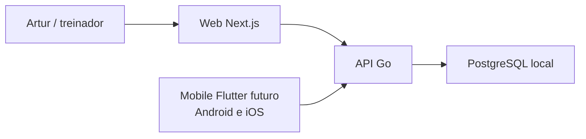

# SysAP

O SysAP e a plataforma de acompanhamento esportivo do Artur Performance. Seu
objetivo e transformar dados reais de treino em historico e informacao
explicavel, sem atribuir aos dispositivos medidas que eles nao produzem.

## Estado atual

A Fase 1 entrega uma fundacao tecnica executavel: PostgreSQL/Supabase local,
API Go com saude e prontidao, dashboard Next.js responsivo, contrato OpenAPI e
gates locais/CI. O dashboard ainda usa dados demonstrativos e suas acoes de
negocio permanecem desabilitadas. Nao ha autenticacao nem cadastro real.



Clientes consultam dados de negocio somente pela API. O Web nao acessa tabelas
PostgreSQL diretamente.

## Estrutura do monorepo

```text
apps/api/             API Go em monolito modular
apps/web/             dashboard responsivo do treinador
apps/mobile/          Flutter/Dart + adapters Kotlin/Swift futuros (ainda ausente)
assets/brand/         identidade visual canonica
contracts/openapi/    contrato HTTP da API
docs/                 arquitetura, design e seguranca
infra/supabase/       configuracao, migration e seed local
scripts/              orquestracao e gates locais
.github/workflows/    CI sem deploy
```

O aplicativo futuro usara Flutter/Dart para Android e iOS. Kotlin ficara apenas
atras de adapters Android, como Health Connect, e Swift atras de adapters Apple,
como HealthKit. `apps/mobile` ainda nao foi criado. Nao existe aplicativo de
smartwatch no MVP.

## Pre-requisitos

- Go oficial 1.26.5 para `linux/amd64`;
- Node.js 24.18.0;
- pnpm 11.15.1;
- Docker Engine 29.3.1 ou compativel;
- Docker Compose v5.1.1 ou compativel.

O Supabase CLI 2.109.1 e uma dependencia local do workspace; nao o instale
globalmente.

## Instalacao segura

```sh
pnpm install --frozen-lockfile --ignore-scripts
```

As dependencias diretas usam versoes exatas. Pacotes novos respeitam quarentena
minima de sete dias. Nao habilite lifecycle scripts sem revisar a necessidade,
origem e conteudo do pacote.

## Execucao local integrada

```sh
pnpm dev
```

O comando verifica as portas, inicia o banco quando necessario, gera e le a
configuracao local sem `source` ou `eval`, compila/inicia a API em
`http://127.0.0.1:8080` e inicia o Web em `http://127.0.0.1:3000`. Ctrl+C encerra
somente API e Web criados pelo comando. O banco e parado apenas quando o proprio
comando o iniciou.

## Execucao manual em terminais separados

Terminal 1, banco local:

```sh
pnpm db:start
pnpm db:reset
pnpm db:lint
pnpm db:env
```

Terminal 2, API:

```sh
pnpm dev:api
```

Terminal 3, Web:

```sh
pnpm dev:web
```

Ao terminar, interrompa API e Web com Ctrl+C e execute `pnpm db:stop`. Os
scripts manuais tambem mantem listeners somente em loopback e nunca imprimem a
URL do banco.

## Banco local

```sh
pnpm db:start
pnpm db:status
pnpm db:reset
pnpm db:lint
pnpm db:env
pnpm db:stop
```

`db:reset` recria o banco local e aplica migrations do zero; nao o use contra
um ambiente com dados que precisem ser preservados. O schema `app` e privado e
a API assume o papel restrito `sysap_api`. Nao ha vinculo com Supabase remoto.

## API

- `GET http://127.0.0.1:8080/healthz`: processo ativo, independente do banco;
- `GET http://127.0.0.1:8080/readyz`: 200 com banco disponivel, 503 sem banco.

As respostas sao JSON sem cache, possuem request ID gerado pelo servidor e nao
exibem erro PostgreSQL nem detalhes de conexao.

## Web

O painel responsivo e voltado a Artur/treinador. Ele consulta a API somente no
servidor, preserva a interface demonstrativa quando API ou banco falham e nao
envia `SYSAP_API_BASE_URL` ao navegador.

## Testes e gates

```sh
pnpm check
pnpm test
pnpm test:api
pnpm test:web
pnpm test:integration
pnpm security:dependencies
pnpm security:secrets
```

`pnpm check` verifica formato Go sem reescrever, modulos, vet, testes com race,
build da API, lint/typecheck/testes/build Web, OpenAPI e scripts. Ele nao inicia
o banco. `test:integration` exige a stack inicialmente parada, aplica migrations
do zero, exercita PostgreSQL real, API e Web, valida degradacao segura e limpa
tudo mesmo em falha.

## OpenAPI

O contrato local esta em `contracts/openapi/openapi.yaml`. `/healthz` e
`/readyz` sao os unicos endpoints implementados; os contratos de identidade sob
`/v1` estao marcados como planejados pela Subfase 2A e ainda nao representam
funcionalidade disponivel:

```sh
pnpm openapi:lint
```

O lint nao publica documentacao. Testes Go preservam os corpos aprovados byte a
byte e a integracao comprova o comportamento real.

## Variaveis de ambiente

`.env.example` e versionado e documenta somente nomes e valores locais
ficticios. `.env.local` e ignorado, criado com permissao `0600` por `pnpm db:env`
e pode conter credencial exclusivamente local; ele nunca e carregado com
`source` ou `eval`.

Segredos de producao pertencem a um gerenciador de segredos, nunca a arquivos
versionados. A arquitetura da Fase 2 nao distribui configuracao ou publishable
key do Supabase aos clientes: Web/mobile autenticam somente pela API Go.
`service_role`, secret key, credencial Twilio, senha e URL do banco jamais podem
entrar no browser, mobile ou Git.

Variaveis usadas nesta fase:

- `SYSAP_ENV`;
- `SYSAP_HTTP_ADDR`;
- `SYSAP_DATABASE_URL`;
- `SYSAP_TEST_DATABASE_URL` somente nos testes integrados;
- `SYSAP_SHUTDOWN_TIMEOUT`;
- `SYSAP_DATABASE_PING_TIMEOUT`;
- `SYSAP_API_BASE_URL` somente no servidor Next.js.

## Politica de segredos

Revise `git diff --cached` antes de todo commit. O gate Gitleaks verifica o
estado atual e o historico com saida redigida. Se houver vazamento, revogue ou
rotacione primeiro; apagar no commit seguinte nao remove o valor do historico.
Detalhes estao em `docs/security/development-security.md`.

## Solucao de problemas do Docker no Ubuntu

Use diagnosticos de menor privilegio:

```sh
systemctl status docker
groups
ls -l /var/run/docker.sock
docker info
docker run --rm hello-world
```

Se o usuario ainda nao pertencer ao grupo `docker`, um administrador pode usar
`sudo usermod -aG docker "$USER"`; depois abra uma nova sessao ou use `newgrp
docker`. Em instalacoes Snap, verifique os logs e a politica AppArmor antes de
alterar o sistema.

Nunca use `chmod 666` no socket, nao execute o SysAP diariamente com `sudo`, nao
desabilite AppArmor permanentemente, nao exponha Docker TCP sem TLS e nao copie
credenciais para o Git.

## Roadmap e limites honestos

A proxima fase tratara identidade, organizacao e primeiro atleta como um corte
vertical separado. Turmas, presencas, prontidao real e feedback virao depois.
GPS sera importado apenas apos o treino; nenhum parser de fabricante sera criado
sem arquivo real e documentacao. Health Connect e HealthKit virao com
consentimento granular por adapters Kotlin/Swift do app Flutter. Nao ha
rastreamento ao vivo nem app de smartwatch no MVP.

Prontidao e carga sao informacoes de apoio ao treinador, nao diagnostico medico
nem previsao de lesao. O SysAP nao infere gol, passe, assistencia, toque na bola
ou xG a partir de GPS.

Uma licenca para distribuicao ainda nao foi decidida; nenhuma foi presumida.
