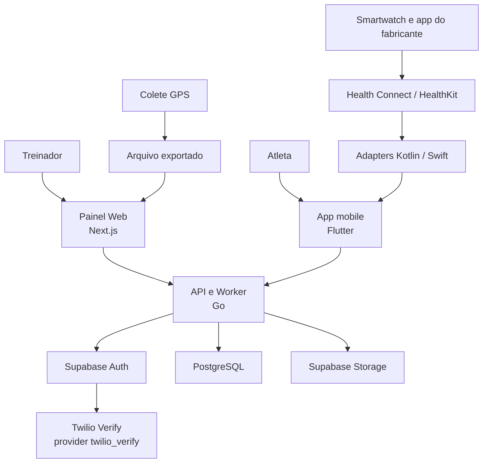
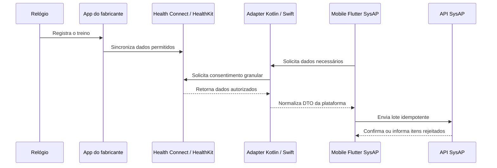
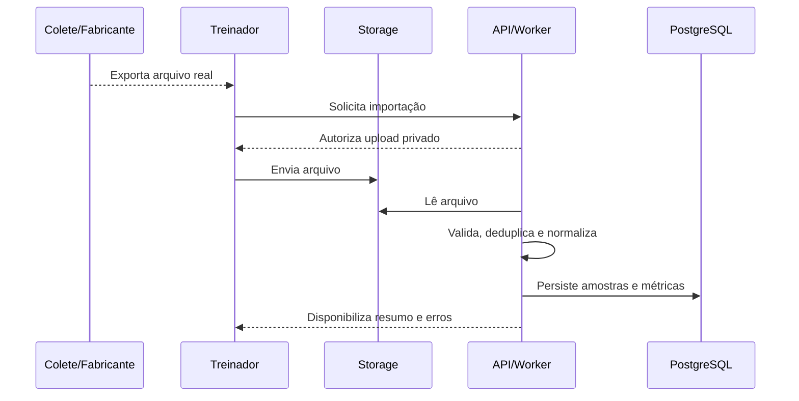

# Arquitetura do SysAP

**Status:** proposta aprovada para implementação incremental
**Versão:** 0.2
**Data:** 22 de julho de 2026

## 1. Visão do produto

O SysAP é uma plataforma de acompanhamento esportivo para o Artur Performance. O treinador administra atletas, turmas e treinos; registra presença e feedback; acompanha prontidão; importa dados de smartwatch e colete GPS; e analisa cada sessão por métricas, caminho percorrido, mapa de calor e evolução histórica.

O valor do MVP não é “ter IA”. É converter dados reais em informações compreensíveis e acionáveis, sempre exibindo fonte, período e limitações.

### Usuários iniciais

- **Administrador/treinador:** Artur e futuros membros autorizados da comissão.
- **Atleta:** consulta os próprios dados e envia informações de prontidão.
- **Atleta sem login:** pode ser cadastrado e acompanhado pelo treinador; importante para menores de idade.

### Capacidades P0 do MVP

1. Autenticação e autorização por organização e papel.
2. Cadastro de atletas, turmas e vínculo entre eles.
3. Criação de treino e controle de presença.
4. Check-in de prontidão e feedback mensal do treinador.
5. Importação pós-treino de arquivo de colete GPS.
6. Sincronização autorizada de treino pelo mobile: Health Connect no Android e
   HealthKit no iOS.
7. Resumo de sessão: duração, distância, velocidade, frequência cardíaca disponível, carga e sprints disponíveis.
8. Caminho normalizado no campo e mapa de calor.
9. Histórico e totais por semana, mês e ano.
10. Auditoria das ações sensíveis.

### Fora do P0

- Rastreamento GPS ao vivo.
- Aplicativo próprio para Wear OS ou integração direta com cada relógio.
- Detecção automática de gol, passe, assistência, toque na bola ou xG.
- Visão computacional, aprendizado de máquina e previsão de lesão.
- Ranking, missões, chat, notificações push e PDF avançado.
- Integração com um fabricante de colete sem arquivo real e documentação.

## 2. Decisões arquiteturais

| Área | Decisão | Motivo |
|---|---|---|
| Repositório | Monorepo | Mantém contrato, aplicações, infraestrutura e documentação sincronizados. |
| Backend | Go em monólito modular | Operação simples no MVP, módulos claros e possibilidade de extração futura. |
| API | REST com OpenAPI | Contrato único para Web, mobile, testes e documentação. |
| Web | Next.js App Router + TypeScript | Painel responsivo do treinador com tipagem e ecossistema maduro. |
| Mobile | Flutter + Dart, com adapters Kotlin/Swift | UI compartilhada Android/iOS e acesso nativo explícito a Health Connect/HealthKit. |
| Banco | PostgreSQL gerenciado pelo Supabase | Banco relacional, migrations SQL e baixo custo operacional inicial. |
| Identidade | Supabase Auth atrás da API Go | Senha, OTP, TOTP, sessões e JWT sem autenticação própria; clientes tratam tokens como opacos e não chamam Auth. |
| OTP SMS | Twilio Verify via `twilio_verify` do Supabase Auth | Provider inicial substituível, sem SDK/chamada Twilio em API, Web ou mobile. |
| Arquivos | Supabase Storage | Arquivos brutos do GPS e artefatos de importação fora do banco. |
| Processamento | Worker no mesmo projeto Go, usando fila em PostgreSQL | Evita adotar mensageria externa antes da necessidade. |
| Inteligência | Regras determinísticas e versionadas | Resultados explicáveis mesmo com pouco histórico. |

As versões exatas de runtime e dependências devem ser fixadas no bootstrap usando versões estáveis e suportadas naquele momento. Não usar `latest` em imagens ou CI.

## 3. Visão de contêineres



Não existe comunicação direta do painel ou do mobile com tabelas de negócio ou
com o Supabase Auth. Inclusive autenticação passa pela API Go. O Next.js atua
como BFF e o mobile usa o mesmo contrato; nenhum cliente recebe credencial
administrativa ou decide papel/organização. URL e publishable key do Auth são
tratadas como descobríveis, não como controle de segurança; signup desligado,
limites Auth/provider e controles de gateway complementam a API.

## 4. Estrutura do monorepo

```text
SysAP/
├── apps/
│   ├── api/                    # API e worker Go
│   ├── web/                    # Next.js/TypeScript
│   └── mobile/                 # Flutter/Dart + adapters Kotlin/Swift futuros
├── contracts/
│   └── openapi/                # contrato HTTP versionado
├── infra/
│   ├── supabase/
│   │   ├── migrations/
│   │   └── seed.sql
│   └── containers/             # imagens/configurações locais
├── docs/
│   ├── architecture.md
│   ├── architecture/decisions/ # ADRs
│   ├── phase-2/                # plano incremental de identidade
│   ├── security/               # ameaças e testes adversariais
│   └── codex/
├── AGENTS.md
├── package.json              # comandos padronizados via pnpm
├── scripts/                  # gates e orquestracao local
└── README.md
```

### Organização interna da API

O backend é um monólito modular. Cada módulo contém transporte HTTP, aplicação, domínio e persistência próximos, sem depender de detalhes de outro módulo.

```text
apps/api/
├── cmd/
│   ├── api/
│   └── worker/
├── internal/
│   ├── identity/               # domínio, aplicação, ports, postgres e HTTP
│   ├── organizations/
│   ├── athletes/
│   ├── teams/
│   ├── training/
│   ├── readiness/
│   ├── feedback/
│   ├── telemetry/
│   ├── analytics/
│   ├── integrations/           # Supabase Auth e fronteiras externas
│   └── platform/               # db, config, logging e HTTP genéricos
└── migrations/                 # link ou fonte única definida no bootstrap
```

Não aplicar uma arquitetura cerimonial com dezenas de interfaces. Na identidade,
as portas pequenas e nomeadas são `IdentityProvider`, `TokenVerifier`,
`SessionRegistry`, `MFAChallengeStore`, `SMSProvider`,
`EnrollmentNumberGenerator`, `Clock`, `RateLimiter`, `SecurityAuditWriter` e
`TransactionManager`. O domínio não importa HTTP, pgx, Supabase ou provider
SMS; a aplicação inicial pede OTP ao `IdentityProvider`, e somente o Supabase
Auth conhece `twilio_verify`.

## 5. Módulos de domínio

| Módulo | Responsabilidade |
|---|---|
| Identity | Matrícula, provisionamento, autenticação, sessão, estado de acesso e coordenação com Auth. |
| Organizations | Organização, membros e isolamento dos dados. |
| Athletes | Perfil esportivo e dados básicos do atleta. |
| Teams | Turmas e vínculos de atletas. |
| Training | Treinos, participantes, presença, duração e RPE. |
| Readiness | Check-in de sono, fadiga, dor muscular, estresse e humor. |
| Feedback | Avaliação e observação mensal do treinador. |
| Telemetry | Upload, validação, idempotência, parsing e normalização de GPS/saúde. |
| Analytics | Métricas de sessão, totais, caminho normalizado, heatmap e alertas. |
| Audit | Registro imutável de ações sensíveis. |

As fronteiras, estados e operações da Fase 2 estão detalhados no
[ADR de identidade](architecture/decisions/0001-phase-2-identity.md) e no
[plano da Fase 2](phase-2/README.md).

## 6. Modelo de dados

Entidades usam UUID, `created_at` e `updated_at` quando aplicável. Tabelas
pertencentes a tenant carregam `organization_id`; registros globais por sujeito,
como `profiles`, `auth_identities`, `auth_sessions` e `auth_challenges`, não
duplicam tenant e são sempre alcançados por membership autorizada. Instantes
são persistidos em UTC com `timestamptz`; datas civis, como nascimento, usam
`date`. `America/Fortaleza` é usado na apresentação e em regra civil
explicitamente documentada, como o ano da matrícula, nunca pelo fuso implícito
do host.

### Núcleo

- `organizations`: unidade proprietária dos dados.
- `profiles`: extensão mínima da identidade, sem credencial.
- `memberships`: identidade, organização, papel e estado autoritativo.
- `auth_identities`: vínculo privado entre sujeito do SysAP e identificador
  técnico opaco de `auth.users`; não aparece como ID de negócio. O mesmo sujeito
  pode existir em `sub` dentro do access JWT, tratado pelo cliente como opaco.
- `athlete_invitations`: pré-cadastro, matrícula global, telefone protegido,
  estado e expiração/cancelamento.
- `identity_operations`: idempotência, estado intermediário, retries e
  reconciliação de comandos externos.
- `auth_sessions`: `session_id`, sujeito e revogação/corte local, sem access ou
  refresh token persistido.
- `auth_challenges`: digest HMAC e metadados mínimos do ticket MFA; o access
  AAL1 fica cifrado por AEAD por até cinco minutos e é apagado ao
  consumir/expirar; chave versionada permanece fora do banco.
- `trainer_athlete_assignments`: escopo explícito do trainer; owner permanece
  autorizado para todos os atletas da organização.
- `security_rate_limits`: janelas/contadores por representações HMAC, sem PII
  bruta como chave observável.
- `teams`: turma, categoria e treinador responsável.
- `athletes`: nome, nascimento, posição/modalidades e vínculo opcional com a
  identidade privada do SysAP.
- `team_athletes`: vínculo temporal entre atleta e turma.

### Acompanhamento

- `training_sessions`: treino agendado/realizado, tipo, início e fim.
- `session_athletes`: participante, presença, minutos e RPE.
- `readiness_checkins`: respostas, nota calculada, versão da fórmula e observação.
- `coach_feedback`: competência avaliada, período, nota e texto.

### Dispositivos e telemetria

- `device_connections`: atleta, origem, identificador externo opaco, permissões e última sincronização.
- `telemetry_imports`: origem, checksum, arquivo, unidade original, parser, status e erro seguro.
- `gps_samples`: importação, atleta/sessão, instante, latitude, longitude, velocidade e aceleração disponíveis.
- `heart_rate_samples`: importação, atleta/sessão, instante e bpm.
- `session_metrics`: métricas agregadas, fonte, cobertura e versão de cálculo.
- `normalized_positions`: amostras transformadas para coordenadas `x/y` de 0 a 1 no campo.
- `heatmap_cells`: grade, intensidade e versão do algoritmo.
- `pitch_calibrations`: quatro pontos do campo, dimensões, data e responsável.
- `audit_events`: ator, ação, recurso, instante e metadados sem segredo.

### Restrições obrigatórias

- Importação idempotente por organização, origem e checksum/identificador externo.
- Atleta autenticado enxerga apenas os próprios dados.
- Treinador enxerga somente atletas da própria organização.
- Arquivo bruto nunca fica público; download usa autorização e URL assinada curta.
- Deleção e retenção devem considerar LGPD e vínculo de menores.

## 7. Contrato da API

Probes técnicos permanecem em `/healthz` e `/readyz`. Endpoints de negócio usam
o prefixo `/v1`; esta decisão substitui a antiga proposta `/api/v1` antes de ela
ser implementada e segue o contrato aprovado na Subfase 2A. Erros usam um
envelope consistente com código estável, mensagem segura, detalhes de validação
e `request_id`.

### Endpoints iniciais

| Método e rota | Uso |
|---|---|
| `GET /healthz` | Saúde do processo, sem depender de serviços externos. |
| `GET /readyz` | Prontidão da API e dependências. |
| `POST /v1/athlete-invitations` | Pré-cadastrar atleta no `X-Organization-ID` validado contra a membership. |
| `POST /v1/athlete-invitations/{id}/resend` | Solicitar reenvio de ativação. |
| `DELETE /v1/athlete-invitations/{id}` | Cancelar convite pendente. |
| `POST /v1/auth/athlete/activate` | Confirmar OTP e senha do atleta. |
| `POST /v1/auth/athlete/login` | Login por matrícula e senha. |
| `POST /v1/auth/staff/login` | Verificar senha e iniciar TOTP de staff. |
| `POST /v1/auth/staff/mfa/enroll` | Iniciar enrollment TOTP quando o ticket exigir bootstrap. |
| `POST /v1/auth/staff/mfa/verify` | Concluir TOTP e emitir sessão AAL2. |
| `POST /v1/auth/refresh` | Rotacionar sessão. |
| `POST /v1/auth/logout` e `/logout-all` | Encerrar sessão atual ou todas. |
| `POST /v1/auth/recovery/request` e `/confirm` | Recuperação genérica para atleta, sem enumeração. |
| `GET /v1/me` | Perfil e memberships atuais; permissões são derivadas server-side. |
| `PATCH /v1/memberships/{id}/access` | Suspender ou reativar acesso. |

Endpoints de atletas, turmas, treinos, prontidão e telemetria continuam no
roadmap e só entram no OpenAPI no corte que os implementar. O contrato da 2A é
conceitual e cada operação planejada está marcada como não implementada.

O arquivo em `contracts/openapi/` é a fonte de verdade do contrato. Web e
mobile não devem criar tipos divergentes manualmente quando geração ou
validação for viável.

## 8. Fluxos de dispositivos

### 8.1 Smartwatch pelo sistema do celular



O aplicativo solicita somente os tipos de dado necessários. Revogação, ausência
de Health Connect/HealthKit e histórico insuficiente devem ter estados de
interface claros. O MVP não pressupõe que todo relógio ou plataforma fornecerá
rota, sono, calorias ou frequência cardíaca com a mesma qualidade. Não existe
app próprio instalado no relógio.

### 8.2 Colete GPS por arquivo



Cada fabricante é um adaptador. Antes de implementar um adaptador, é obrigatório guardar como fixture anonimizada um arquivo real representativo e documentar colunas, unidades, frequência, timezone e valores ausentes.

### 8.3 Campo e mapa de calor

GPS geográfico não vira automaticamente posição correta em um campo desenhado. O treinador calibra os quatro cantos do campo. O pipeline transforma latitude/longitude em coordenadas normalizadas, remove pontos claramente inválidos sem apagar o bruto, agrega a permanência por células e salva a versão do algoritmo.

O resultado deve informar cobertura e qualidade. Se a precisão não for suficiente, o sistema mostra “dados insuficientes” em vez de fabricar um mapa bonito.

## 9. Inteligência explicável

O MVP usa fórmulas determinísticas, não aprendizado de máquina.

- **Prontidão:** combinação configurável de sono percebido, fadiga, dor muscular, estresse e humor.
- **Carga interna:** duração em minutos multiplicada pelo RPE da sessão, quando disponível.
- **Carga externa:** distância, sprints, acelerações e tempo em zonas, somente quando a fonte fornecer.
- **Tendência:** comparação com a própria linha de base do atleta, nunca com um “atleta ideal”.
- **Alertas:** dados ausentes, carga atípica, queda persistente de prontidão ou feedback pendente.

Cada resultado inclui `calculation_version`, `source`, `generated_at`, janela analisada e explicação curta. Os alertas apoiam o treinador; não diagnosticam lesão nem substituem profissional de saúde.

## 10. Frontend web

O painel segue a linguagem visual escura do protótipo, mas a arquitetura da interface começa pelas tarefas do treinador:

1. Dashboard com atletas ativos, presença, prontidão e alertas.
2. Atletas e perfil individual.
3. Turmas.
4. Calendário e criação de treino.
5. Presença em lote.
6. Importações e erros.
7. Sessão com resumo, caminho e heatmap.
8. Evolução e totais por período.

Usar Server Components por padrão e Client Components apenas para interação, gráficos e mapas. Chamadas à API devem passar por uma camada tipada. Estados de carregamento, vazio, erro, sem permissão e dados insuficientes fazem parte da definição de pronto.

### Identidade visual

A logo canônica é `assets/brand/artur-performance-logo.png`, em PNG transparente. O produto usa superfícies escuras, branco e dourado. Os tokens iniciais estão documentados em `assets/brand/README.md`; o dourado principal é `#D4AE29`. Elementos dourados usam texto escuro para contraste. A logo não pode ser redesenhada, recolorida, distorcida ou receber efeitos adicionais.

## 11. Aplicativo mobile

O aplicativo do atleta será compartilhado em Flutter/Dart para Android e iOS:

- arquitetura por features e fluxo unidirecional de estado;
- cliente tipado para a API Go; autenticação também passa pela API;
- Health Connect atrás de adapter Kotlin;
- HealthKit atrás de adapter Swift;
- refresh token cifrado em armazenamento privado Android com chave não
  exportável no Keystore, ou guardado no Apple Keychain;
- armazenamento local mínimo e nenhum token em arquivo, preferência comum ou
  log;
- telas de início, prontidão, treino sincronizado, evolução e perfil.

Kotlin/Swift existem somente onde a API nativa exigir. Não criar módulo Wear OS
ou watchOS no P0. O relógio conversa primeiro com o sistema/aplicativo do
fabricante no celular. Consulte o
[ADR mobile](architecture/decisions/0002-cross-platform-mobile.md).

## 12. Segurança, privacidade e LGPD

- Coletar apenas dados necessários e registrar finalidade e consentimento.
- Permissões granulares e revogáveis para Health Connect e HealthKit.
- Separar autenticação de autorização; JWT válido não concede acesso a outra
  organização e não ignora suspensão.
- Supabase Auth guarda senha, OTP/TOTP e sessões; a API confirma papel,
  organização e estado autoritativos no PostgreSQL.
- Toda rota protegida confirma `session_id`; logout marca revogação local antes
  do sign-out porque o access JWT continua verificável até `exp`.
- Não enviar `service_role`, conexão do banco, segredo Auth ou credencial Twilio
  para browser/mobile.
- Manter `auth.sms.enable_signup = false`; OTP só para identidade pré-criada.
- Twilio Verify é configurado apenas no Supabase Auth. Local/CI usa
  `auth.sms.test_otp`, provider real ausente e nenhuma rede externa.
- Criptografia em trânsito e recursos privados no Storage.
- Logs estruturados sem senha, OTP, token, telefone/email completo, conteúdo de
  feedback, erro bruto de provider ou dados brutos de saúde.
- Auditoria de convite, provisionamento, OTP, autenticação, sessão, suspensão,
  alteração de papel, importação, exportação e exclusão.
- Processo de acesso, correção, portabilidade e exclusão de dados.
- Consentimento do responsável e regras de retenção para menores antes de uso real.
- Backup e teste periódico de restauração antes da produção.

## 13. Observabilidade e operação

- Logs JSON com `request_id`, usuário técnico, organização e latência, sem dados sensíveis.
- Métricas de requisições, erros, duração de imports e tamanho das filas.
- Endpoints separados de liveness e readiness.
- Ambientes local, staging e produção com segredos distintos; credenciais SMS
  somente server-side e externas ao Git.
- API empacotada em container; banco e Storage gerenciados pelo Supabase.
- GitHub Actions para validar API, Web, mobile quando criado, OpenAPI e
  migrations.

## 14. Estratégia de testes

| Camada | Testes mínimos |
|---|---|
| Domínio Go | Tabelas de casos para autorização, prontidão, carga e normalização. |
| Persistência | Integração com PostgreSQL real em container. |
| GPS | Fixtures anonimizadas, idempotência, unidades, arquivo inválido e pontos ausentes. |
| API | Contrato, validação, isolamento de organização e respostas de erro. |
| Web | Componentes críticos e fluxos de presença/importação. |
| Mobile | Sessão segura, permissão negada, Health Connect/HealthKit indisponível, sincronização repetida e offline. |
| E2E | Treinador cria atleta e treino, marca presença, importa dados e vê o resumo. |

## 15. Plano priorizado

### Fase 0 — Repositório e decisões

- Arquitetura, `AGENTS.md`, README e prompt de implementação.
- Resultado: escopo revisável antes do primeiro código.

### Fase 1 — Fundação executável

- Estrutura do monorepo.
- API Go com configuração, logs, `/healthz`, `/readyz` e testes.
- Next.js com shell visual e página de estado.
- PostgreSQL/Supabase local, primeira migration e seed fictício.
- OpenAPI inicial, comandos pnpm na raiz, `.env.example` e CI.
- Resultado: tudo sobe localmente e os gates passam.

Estado implementado em 21 de julho de 2026: fundacao PostgreSQL privada local,
API Go com `healthz`/`readyz`, dashboard Next.js demonstrativo, contrato OpenAPI
3.1, orquestracao Node sem shell, gates de dependencia/segredos e GitHub Actions
sem deploy. Autenticacao e dados de negocio continuam reservados para as fases
seguintes.

### Fase 2 — Identidade e atletas

- Subfase 2A: ADRs, ameaças, testes adversariais futuros e contrato OpenAPI.
- Supabase Auth atrás da API, validação JWT, RBAC e suspensão autoritativa.
- Organização, memberships, convite, matrícula, ativação, login, recovery,
  sessões, rate limiting, reconciliação e auditoria.
- Twilio Verify preferencial via `twilio_verify`; produção permanece um gate.
- Primeiro corte vertical Web + API + banco; detalhes em
  [`docs/phase-2/README.md`](phase-2/README.md).

### Fase 3 — Rotina do treinador

- Sessões, calendário, presença, RPE, prontidão e feedback mensal.
- Dashboard inicial com dados reais do banco.

### Fase 4 — Colete GPS

- Obter arquivo real e registrar ADR do formato escolhido.
- Upload privado, worker, parser, idempotência e métricas.
- Calibração do campo, caminho normalizado e heatmap.

### Fase 5 — Mobile e smartwatch

- App Flutter para Android/iOS, autenticação e prontidão.
- Adapters Kotlin/Health Connect e Swift/HealthKit.
- Dados no resumo e histórico do atleta.

### Fase 6 — Evolução e endurecimento

- Totais por período, alertas explicáveis e relatório básico.
- E2E, acessibilidade, observabilidade, retenção e testes de restauração.

Cada fase termina com demonstração, revisão do diff, testes e atualização da documentação. Não começar a fase seguinte com falhas conhecidas sem registrá-las e obter decisão.

## 16. Riscos e decisões pendentes

| Risco/decisão | Tratamento |
|---|---|
| Modelo exato do colete ainda não confirmado | Não implementar parser; exigir arquivo real e manual do fabricante. |
| Relógios e plataformas fornecem dados diferentes | Mostrar disponibilidade por fonte e testar Health Connect/HealthKit em aparelhos reais. |
| Precisão do GPS comprometer o heatmap | Calibração, indicador de cobertura e estado “dados insuficientes”. |
| Dados de menores | Consentimento, minimização, acesso e retenção definidos antes do piloto. |
| Escopo grande para um desenvolvedor iniciante | Uma fase e um corte vertical por vez, com checkpoints obrigatórios. |
| Fórmulas parecerem diagnóstico | Explicações visíveis, versionamento e linguagem não médica. |
| SMS pumping e custo variável | Rate limit/quota/circuit breaker da API, Fraud Guard, destinos restritos e alertas; carga só com fake. |
| SIM swap e indisponibilidade SMS | SMS restrito a atleta, TOTP para staff, recuperação assistida e alternativa futura não-PSTN. |
| Twilio no Brasil | Confirmar preço, entregabilidade, operação e credencial antes de produção; provider permanece substituível. |

## 17. Referências oficiais

- [Health Connect — início](https://developer.android.com/health-and-fitness/health-connect/get-started)
- [Health Connect — permissões e acesso](https://developer.android.com/health-and-fitness/health-connect/ui/permissions)
- [Health Connect — experiências de treino](https://developer.android.com/health-and-fitness/health-connect/experiences/workouts)
- [Supabase Auth](https://supabase.com/docs/guides/auth)
- [Supabase JWT](https://supabase.com/docs/guides/auth/jwts)
- [Supabase CLI Auth/SMS](https://supabase.com/docs/guides/local-development/cli/config)
- [Supabase MFA TOTP](https://supabase.com/docs/guides/auth/auth-mfa/totp)
- [Supabase Row Level Security](https://supabase.com/docs/guides/database/postgres/row-level-security)
- [Next.js App Router](https://nextjs.org/docs/app/getting-started)
- [Go Modules](https://go.dev/ref/mod)
- [Flutter platform channels](https://docs.flutter.dev/platform-integration/platform-channels)
- [Apple HealthKit](https://developer.apple.com/documentation/healthkit)
- [NIST SP 800-63B](https://pages.nist.gov/800-63-4/sp800-63b.html)
- [Twilio Verify Fraud Guard](https://www.twilio.com/docs/verify/preventing-toll-fraud/sms-fraud-guard)
