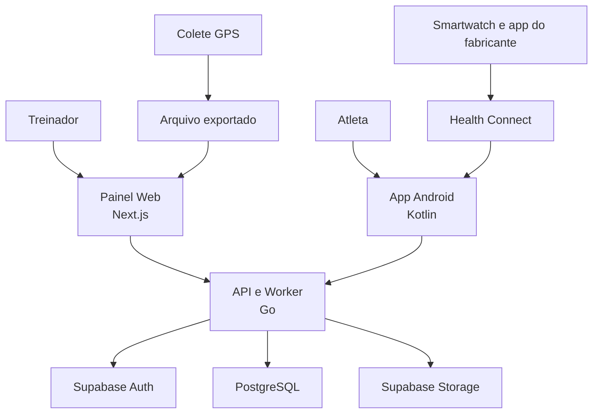
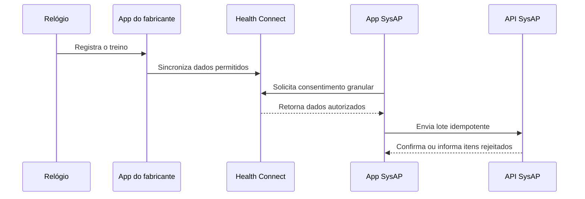
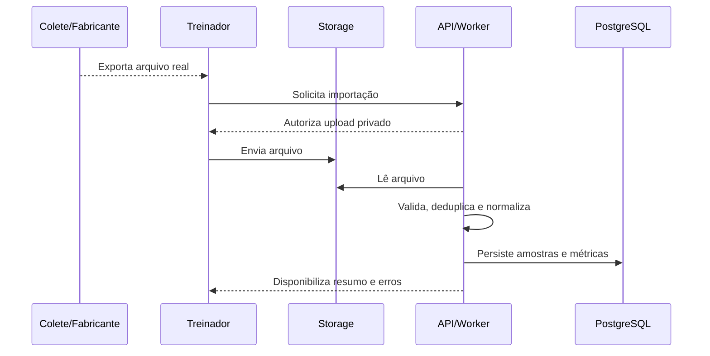

# Arquitetura do SysAP

**Status:** proposta aprovada para implementação incremental  
**Versão:** 0.1  
**Data:** 21 de julho de 2026

## 1. Visão do produto

O SysAP é uma plataforma de acompanhamento esportivo para o Artur Performance. O treinador administra atletas, turmas e treinos; registra presença e feedback; acompanha prontidão; importa dados de smartwatch e colete GPS; e analisa cada sessão por métricas, caminho percorrido, mapa de calor e evolução histórica.

O valor do MVP não é “ter IA”. É converter dados reais em informações compreensíveis e acionáveis, sempre exibindo fonte, período e limitações.

### Usuários iniciais

- **Administrador/treinador:** Artur e futuros membros autorizados da comissão.
- **Atleta:** consulta os próprios dados e envia informações de prontidão.
- **Atleta sem login:** pode ser cadastrado e acompanhado pelo treinador; importante para menores de idade.

### Capacidades P0 do MVP

1. Autenticação e autorização por organização e papel.
2. Cadastro de atletas, turmas e vínculo entre eles.
3. Criação de treino e controle de presença.
4. Check-in de prontidão e feedback mensal do treinador.
5. Importação pós-treino de arquivo de colete GPS.
6. Sincronização autorizada de treino pelo Android/Health Connect.
7. Resumo de sessão: duração, distância, velocidade, frequência cardíaca disponível, carga e sprints disponíveis.
8. Caminho normalizado no campo e mapa de calor.
9. Histórico e totais por semana, mês e ano.
10. Auditoria das ações sensíveis.

### Fora do P0

- Rastreamento GPS ao vivo.
- Aplicativo próprio para Wear OS ou integração direta com cada relógio.
- Detecção automática de gol, passe, assistência, toque na bola ou xG.
- Visão computacional, aprendizado de máquina e previsão de lesão.
- Ranking, missões, chat, notificações push e PDF avançado.
- Integração com um fabricante de colete sem arquivo real e documentação.

## 2. Decisões arquiteturais

| Área | Decisão | Motivo |
|---|---|---|
| Repositório | Monorepo | Mantém contrato, aplicações, infraestrutura e documentação sincronizados. |
| Backend | Go em monólito modular | Operação simples no MVP, módulos claros e possibilidade de extração futura. |
| API | REST com OpenAPI | Contrato único para web, Android, testes e documentação. |
| Web | Next.js App Router + TypeScript | Painel responsivo do treinador com tipagem e ecossistema maduro. |
| Android | Kotlin + Jetpack Compose | Integração nativa com permissões e Health Connect. |
| Banco | PostgreSQL gerenciado pelo Supabase | Banco relacional, migrations SQL e baixo custo operacional inicial. |
| Identidade | Supabase Auth | Sessões e emissão de JWT sem construir autenticação própria. |
| Arquivos | Supabase Storage | Arquivos brutos do GPS e artefatos de importação fora do banco. |
| Processamento | Worker no mesmo projeto Go, usando fila em PostgreSQL | Evita adotar mensageria externa antes da necessidade. |
| Inteligência | Regras determinísticas e versionadas | Resultados explicáveis mesmo com pouco histórico. |

As versões exatas de runtime e dependências devem ser fixadas no bootstrap usando versões estáveis e suportadas naquele momento. Não usar `latest` em imagens ou CI.

## 3. Visão de contêineres



Não existe comunicação direta do painel ou do Android com tabelas de negócio. Os clientes podem usar o SDK do Supabase para o fluxo de autenticação, mas toda regra e dado do SysAP passam pela API.

## 4. Estrutura do monorepo

```text
SysAP/
├── apps/
│   ├── api/                    # API e worker Go
│   ├── web/                    # Next.js/TypeScript
│   └── android/                # Kotlin/Jetpack Compose
├── contracts/
│   └── openapi/                # contrato HTTP versionado
├── infra/
│   ├── supabase/
│   │   ├── migrations/
│   │   └── seed.sql
│   └── containers/             # imagens/configurações locais
├── docs/
│   ├── architecture.md
│   ├── decisions/              # ADRs futuros
│   └── codex/
├── AGENTS.md
├── Makefile
└── README.md
```

### Organização interna da API

O backend é um monólito modular. Cada módulo contém transporte HTTP, aplicação, domínio e persistência próximos, sem depender de detalhes de outro módulo.

```text
apps/api/
├── cmd/
│   ├── api/
│   └── worker/
├── internal/
│   ├── identity/
│   ├── organizations/
│   ├── athletes/
│   ├── teams/
│   ├── training/
│   ├── readiness/
│   ├── feedback/
│   ├── telemetry/
│   ├── analytics/
│   └── platform/               # db, auth, logging, clock e HTTP compartilhado
└── migrations/                 # link ou fonte única definida no bootstrap
```

Não aplicar uma arquitetura cerimonial com dezenas de interfaces. Interfaces são úteis nas fronteiras que realmente mudam: banco, relógio/Health Connect, formato de colete, armazenamento e relógio de sistema para testes.

## 5. Módulos de domínio

| Módulo | Responsabilidade |
|---|---|
| Identity | Validar JWT, usuário atual e papéis. |
| Organizations | Organização, membros e isolamento dos dados. |
| Athletes | Perfil esportivo e dados básicos do atleta. |
| Teams | Turmas e vínculos de atletas. |
| Training | Treinos, participantes, presença, duração e RPE. |
| Readiness | Check-in de sono, fadiga, dor muscular, estresse e humor. |
| Feedback | Avaliação e observação mensal do treinador. |
| Telemetry | Upload, validação, idempotência, parsing e normalização de GPS/saúde. |
| Analytics | Métricas de sessão, totais, caminho normalizado, heatmap e alertas. |
| Audit | Registro imutável de ações sensíveis. |

## 6. Modelo de dados

Todas as tabelas de negócio usam UUID, `created_at`, `updated_at` quando aplicável e `organization_id` para isolamento. Instantes são persistidos em UTC com `timestamptz`; datas civis, como nascimento, usam `date`. O fuso `America/Fortaleza` é responsabilidade da apresentação.

### Núcleo

- `organizations`: unidade proprietária dos dados.
- `profiles`: extensão mínima de `auth.users` para usuários autenticados.
- `memberships`: usuário, organização, papel e status.
- `teams`: turma, categoria e treinador responsável.
- `athletes`: nome, nascimento, posição/modalidades e `auth_user_id` opcional.
- `team_athletes`: vínculo temporal entre atleta e turma.

### Acompanhamento

- `training_sessions`: treino agendado/realizado, tipo, início e fim.
- `session_athletes`: participante, presença, minutos e RPE.
- `readiness_checkins`: respostas, nota calculada, versão da fórmula e observação.
- `coach_feedback`: competência avaliada, período, nota e texto.

### Dispositivos e telemetria

- `device_connections`: atleta, origem, identificador externo opaco, permissões e última sincronização.
- `telemetry_imports`: origem, checksum, arquivo, unidade original, parser, status e erro seguro.
- `gps_samples`: importação, atleta/sessão, instante, latitude, longitude, velocidade e aceleração disponíveis.
- `heart_rate_samples`: importação, atleta/sessão, instante e bpm.
- `session_metrics`: métricas agregadas, fonte, cobertura e versão de cálculo.
- `normalized_positions`: amostras transformadas para coordenadas `x/y` de 0 a 1 no campo.
- `heatmap_cells`: grade, intensidade e versão do algoritmo.
- `pitch_calibrations`: quatro pontos do campo, dimensões, data e responsável.
- `audit_events`: ator, ação, recurso, instante e metadados sem segredo.

### Restrições obrigatórias

- Importação idempotente por organização, origem e checksum/identificador externo.
- Atleta autenticado enxerga apenas os próprios dados.
- Treinador enxerga somente atletas da própria organização.
- Arquivo bruto nunca fica público; download usa autorização e URL assinada curta.
- Deleção e retenção devem considerar LGPD e vínculo de menores.

## 7. Contrato da API

Prefixo: `/api/v1`. Erros usam um envelope consistente com código estável, mensagem segura, detalhes de validação e `request_id`.

### Endpoints iniciais

| Método e rota | Uso |
|---|---|
| `GET /healthz` | Saúde do processo, sem depender de serviços externos. |
| `GET /readyz` | Prontidão da API e dependências. |
| `GET /me` | Perfil, organização e permissões atuais. |
| `GET/POST /athletes` | Listar e cadastrar atletas. |
| `GET/PATCH /athletes/{id}` | Consultar e editar um atleta. |
| `GET/POST /teams` | Administrar turmas. |
| `POST /teams/{id}/athletes` | Vincular atleta à turma. |
| `GET/POST /training-sessions` | Agenda e criação de treino. |
| `PUT /training-sessions/{id}/attendance` | Presença em lote. |
| `POST /athletes/{id}/readiness-checkins` | Check-in do atleta. |
| `POST /athletes/{id}/feedback` | Feedback do treinador. |
| `POST /telemetry/gps-imports` | Iniciar upload/importação do colete. |
| `GET /telemetry/imports/{id}` | Acompanhar status e erros do import. |
| `POST /telemetry/health-connect/workouts` | Sincronizar treino autorizado. |
| `GET /training-sessions/{id}/summary` | Resumo calculado da sessão. |
| `GET /training-sessions/{id}/path` | Caminho normalizado do atleta. |
| `GET /training-sessions/{id}/heatmap` | Grade do mapa de calor. |
| `GET /athletes/{id}/history` | Séries e totais por período. |

O arquivo em `contracts/openapi/` é a fonte de verdade do contrato. O frontend e o Android não devem criar tipos divergentes manualmente quando geração ou validação for viável.

## 8. Fluxos de dispositivos

### 8.1 Smartwatch por Health Connect



O aplicativo solicita somente os tipos de dado necessários. Revogação, ausência de Health Connect e histórico insuficiente devem ter estados de interface claros. O MVP não pressupõe que todo relógio fornecerá rota, sono, calorias ou frequência cardíaca com a mesma qualidade.

### 8.2 Colete GPS por arquivo



Cada fabricante é um adaptador. Antes de implementar um adaptador, é obrigatório guardar como fixture anonimizada um arquivo real representativo e documentar colunas, unidades, frequência, timezone e valores ausentes.

### 8.3 Campo e mapa de calor

GPS geográfico não vira automaticamente posição correta em um campo desenhado. O treinador calibra os quatro cantos do campo. O pipeline transforma latitude/longitude em coordenadas normalizadas, remove pontos claramente inválidos sem apagar o bruto, agrega a permanência por células e salva a versão do algoritmo.

O resultado deve informar cobertura e qualidade. Se a precisão não for suficiente, o sistema mostra “dados insuficientes” em vez de fabricar um mapa bonito.

## 9. Inteligência explicável

O MVP usa fórmulas determinísticas, não aprendizado de máquina.

- **Prontidão:** combinação configurável de sono percebido, fadiga, dor muscular, estresse e humor.
- **Carga interna:** duração em minutos multiplicada pelo RPE da sessão, quando disponível.
- **Carga externa:** distância, sprints, acelerações e tempo em zonas, somente quando a fonte fornecer.
- **Tendência:** comparação com a própria linha de base do atleta, nunca com um “atleta ideal”.
- **Alertas:** dados ausentes, carga atípica, queda persistente de prontidão ou feedback pendente.

Cada resultado inclui `calculation_version`, `source`, `generated_at`, janela analisada e explicação curta. Os alertas apoiam o treinador; não diagnosticam lesão nem substituem profissional de saúde.

## 10. Frontend web

O painel segue a linguagem visual escura do protótipo, mas a arquitetura da interface começa pelas tarefas do treinador:

1. Dashboard com atletas ativos, presença, prontidão e alertas.
2. Atletas e perfil individual.
3. Turmas.
4. Calendário e criação de treino.
5. Presença em lote.
6. Importações e erros.
7. Sessão com resumo, caminho e heatmap.
8. Evolução e totais por período.

Usar Server Components por padrão e Client Components apenas para interação, gráficos e mapas. Chamadas à API devem passar por uma camada tipada. Estados de carregamento, vazio, erro, sem permissão e dados insuficientes fazem parte da definição de pronto.

## 11. Aplicativo Android

O aplicativo do atleta será Android nativo com:

- Kotlin e Jetpack Compose.
- arquitetura por features e fluxo unidirecional de estado;
- Supabase Auth para sessão;
- cliente gerado/tipado para a API;
- Health Connect atrás de um repositório/adaptador;
- WorkManager apenas para sincronização permitida e recuperável;
- armazenamento local mínimo e criptografado quando houver dado sensível;
- telas de início, prontidão, treino sincronizado, evolução e perfil.

Não criar módulo Wear OS no P0. O relógio conversa primeiro com o aplicativo do fabricante e com o Health Connect.

## 12. Segurança, privacidade e LGPD

- Coletar apenas dados necessários e registrar finalidade e consentimento.
- Permissões granulares e revogáveis para Health Connect.
- Separar autenticação de autorização; JWT válido não concede acesso a outra organização.
- Não enviar `service_role`, conexão do banco ou segredo para browser/Android.
- Criptografia em trânsito e recursos privados no Storage.
- Logs estruturados sem token, conteúdo de feedback ou dados brutos de saúde.
- Auditoria de cadastro, alteração de papel, importação, exportação e exclusão.
- Processo de acesso, correção, portabilidade e exclusão de dados.
- Consentimento do responsável e regras de retenção para menores antes de uso real.
- Backup e teste periódico de restauração antes da produção.

## 13. Observabilidade e operação

- Logs JSON com `request_id`, usuário técnico, organização e latência, sem dados sensíveis.
- Métricas de requisições, erros, duração de imports e tamanho das filas.
- Endpoints separados de liveness e readiness.
- Ambientes local, homologação e produção com segredos distintos.
- API empacotada em container; banco e Storage gerenciados pelo Supabase.
- GitHub Actions para validar API, web, Android, OpenAPI e migrations.

## 14. Estratégia de testes

| Camada | Testes mínimos |
|---|---|
| Domínio Go | Tabelas de casos para autorização, prontidão, carga e normalização. |
| Persistência | Integração com PostgreSQL real em container. |
| GPS | Fixtures anonimizadas, idempotência, unidades, arquivo inválido e pontos ausentes. |
| API | Contrato, validação, isolamento de organização e respostas de erro. |
| Web | Componentes críticos e fluxos de presença/importação. |
| Android | Permissão negada, Health Connect indisponível, sincronização repetida e offline. |
| E2E | Treinador cria atleta e treino, marca presença, importa dados e vê o resumo. |

## 15. Plano priorizado

### Fase 0 — Repositório e decisões

- Arquitetura, `AGENTS.md`, README e prompt de implementação.
- Resultado: escopo revisável antes do primeiro código.

### Fase 1 — Fundação executável

- Estrutura do monorepo.
- API Go com configuração, logs, `/healthz`, `/readyz` e testes.
- Next.js com shell visual e página de estado.
- PostgreSQL/Supabase local, primeira migration e seed fictício.
- OpenAPI inicial, Makefile, `.env.example` e CI.
- Resultado: tudo sobe localmente e os gates passam.

### Fase 2 — Identidade e atletas

- Supabase Auth, validação JWT e RBAC.
- Organização, membros, atletas e turmas.
- Primeiro corte vertical web + API + banco.

### Fase 3 — Rotina do treinador

- Sessões, calendário, presença, RPE, prontidão e feedback mensal.
- Dashboard inicial com dados reais do banco.

### Fase 4 — Colete GPS

- Obter arquivo real e registrar ADR do formato escolhido.
- Upload privado, worker, parser, idempotência e métricas.
- Calibração do campo, caminho normalizado e heatmap.

### Fase 5 — Android e smartwatch

- App Android, autenticação e prontidão.
- Permissões e sincronização Health Connect.
- Dados no resumo e histórico do atleta.

### Fase 6 — Evolução e endurecimento

- Totais por período, alertas explicáveis e relatório básico.
- E2E, acessibilidade, observabilidade, retenção e testes de restauração.

Cada fase termina com demonstração, revisão do diff, testes e atualização da documentação. Não começar a fase seguinte com falhas conhecidas sem registrá-las e obter decisão.

## 16. Riscos e decisões pendentes

| Risco/decisão | Tratamento |
|---|---|
| Modelo exato do colete ainda não confirmado | Não implementar parser; exigir arquivo real e manual do fabricante. |
| Relógios fornecem dados diferentes | Mostrar disponibilidade por fonte e testar Health Connect em aparelho real. |
| Precisão do GPS comprometer o heatmap | Calibração, indicador de cobertura e estado “dados insuficientes”. |
| Dados de menores | Consentimento, minimização, acesso e retenção definidos antes do piloto. |
| Escopo grande para um desenvolvedor iniciante | Uma fase e um corte vertical por vez, com checkpoints obrigatórios. |
| Fórmulas parecerem diagnóstico | Explicações visíveis, versionamento e linguagem não médica. |

## 17. Referências oficiais

- [Health Connect — início](https://developer.android.com/health-and-fitness/health-connect/get-started)
- [Health Connect — permissões e acesso](https://developer.android.com/health-and-fitness/health-connect/ui/permissions)
- [Health Connect — experiências de treino](https://developer.android.com/health-and-fitness/health-connect/experiences/workouts)
- [Supabase Auth](https://supabase.com/docs/guides/auth)
- [Supabase JWT](https://supabase.com/docs/guides/auth/jwts)
- [Supabase Row Level Security](https://supabase.com/docs/guides/database/postgres/row-level-security)
- [Next.js App Router](https://nextjs.org/docs/app/getting-started)
- [Go Modules](https://go.dev/ref/mod)
