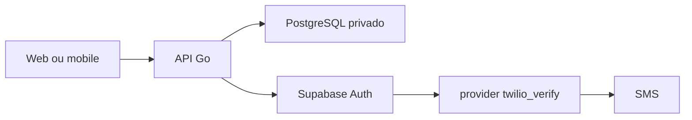
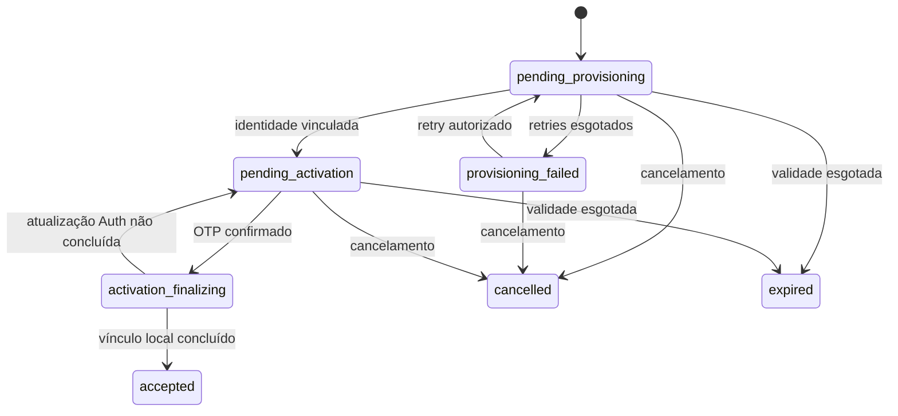

# ADR 0001 — Identidade e acesso da Fase 2

- **Status:** aprovado para implementação incremental
- **Data:** 22 de julho de 2026
- **Escopo:** arquitetura e contrato; nenhuma implementação nesta decisão

## Contexto

O SysAP precisa ativar atletas por telefone, permitir login por matrícula e
senha e autorizar `owner`, `trainer` e `athlete` sem expor tabelas ou segredos
aos clientes. PostgreSQL e Supabase Auth não compartilham transação. SMS tem
custo, disponibilidade e riscos próprios, como troca de SIM e geração
fraudulenta de tráfego.

A matrícula é um identificador apresentado ao atleta, não uma credencial
técnica nem um segredo. O JWT prova uma identidade autenticada, mas não prova
sozinho que o vínculo, o papel e o acesso continuam válidos no SysAP.

## Decisão

### Fronteiras e fluxo

- Web e mobile usam somente a API Go para autenticação e dados de negócio. A
  URL e uma eventual publishable key do Auth são tratadas como descobríveis,
  nunca como fronteira de segurança; nenhuma delas é distribuída pelo SysAP.
- A API coordena casos de uso, resolve matrícula, aplica rate limiting,
  autoriza pelo estado persistido e escreve auditoria.
- PostgreSQL persiste organizações, vínculos, matrícula, estados,
  idempotência, comandos locais e auditoria.
- Supabase Auth guarda/verifica senhas, mantém `auth.users`, emite e renova
  tokens, verifica OTP, mantém MFA e revoga sessões.
- Twilio Verify é o provider inicial preferencial de OTP SMS, configurado
  exclusivamente como `twilio_verify` no Supabase Auth. Não existe chamada,
  credencial ou SDK Twilio na API, Web ou aplicação Flutter.

A decisão complementar sobre Twilio substitui o gate anterior de escolher um
provider antes da Subfase 2E. A aprovação para **produção** continua pendente
de preço, entregabilidade no Brasil e capacidade operacional.

### Configuração por ambiente

| Ambiente | Decisão |
|---|---|
| Testes automatizados e CI | `auth.sms.test_otp`, um número reservado e fictício, provider/credenciais reais ausentes e rede externa proibida. |
| Desenvolvimento local | Auth local controlado; nenhum SMS real. Números fora do mapa de teste devem falhar fechados. |
| Teste manual autorizado | Twilio trial apenas para destino previamente verificado, mantido fora do Git. |
| Staging | `twilio_verify`, quota/circuit breaker da API, allowlist server-only de destinos manuais fora do Git, Geo Permissions por região, Fraud Guard, alertas e orçamento. |
| Produção | Gate explícito após avaliação de preço, entregabilidade no Brasil, suporte, observabilidade, runbook e alternativa de recuperação. |

Em todos os ambientes, `auth.sms.enable_signup = false`. O envio de OTP só é
solicitado para identidade já provisionada e o equivalente a
`shouldCreateUser: false` é obrigatório em toda operação aplicável. Não há
criação automática de usuário por OTP nem cadastro público de organização,
`owner`, `trainer` ou `athlete`.

Account SID, Auth Token e Verify Service SID são configuração **server-only** do
Supabase Auth. Nenhum valor é versionado. Os futuros nomes de variáveis serão
registrados somente em `.env.example`, com valores vazios ou fictícios, quando
a subfase de configuração for autorizada.

A [configuração oficial da CLI do Supabase](https://supabase.com/docs/guides/local-development/cli/config)
documenta `auth.sms.enable_signup`, `auth.sms.test_otp`, o provider
`twilio_verify` e a substituição de segredo por ambiente. A proteção do
provider não substitui os limites próprios da API.

### Matrícula e identidade técnica

- A matrícula é uma string de exatamente dez dígitos: ano de criação em
  `America/Fortaleza` mais seis dígitos gerados por CSPRNG.
- A API é a única geradora; o banco impõe formato e unicidade global.
- Colisões usam novas tentativas com limite; uma matrícula nunca é derivada de
  nome, telefone ou nascimento, nem reutilizada.
- Um identificador Auth opaco, aleatório e não derivado de PII ou matrícula
  liga o registro privado ao `auth.users`. Ele não é exibido como ID de negócio,
  campo de resposta ou parâmetro aceito pela API.
- O access JWT do Supabase contém esse sujeito em `sub`. Web e mobile tratam o
  token inteiro como credencial opaca: não mostram, persistem em log nem usam
  `sub` para autorização. Ocultar o valor do portador do próprio JWT exigiria
  um token opaco próprio e foi rejeitado. Consulte a
  [estrutura oficial dos JWTs do Supabase](https://supabase.com/docs/guides/auth/jwts).
- A representação compatível com Supabase Auth será validada no início da
  Subfase 2B; essa validação não autoriza usar a matrícula como email, telefone
  ou identificador técnico.

No login do atleta, a API limita a requisição antes de leitura sensível,
resolve a matrícula e usa um identificador fictício constante quando não há
registro. Em seguida delega a verificação da senha ao Supabase Auth e sempre
retorna a mesma falha pública para matrícula, senha, organização ou estado
inválido. A API não guarda, transforma nem registra a senha.

Como a verificação de senha pode criar uma sessão antes da autorização local,
a API mantém o par retornado sob custódia server-only até consultar vínculo,
organização e estado. Se a autorização falhar, solicita a revogação e não
entrega token algum; se passar, registra a sessão pelo `session_id` verificado
e só então responde. A mesma regra vale para refresh: o novo par não sai da
API antes de nova checagem do estado autoritativo.

### Ativação e política de OTP

1. `owner` ou `trainer` autorizado pré-cadastra o atleta.
2. PostgreSQL reserva a matrícula e registra `pending_provisioning`.
3. Após o commit, a integração administrativa server-only provisiona a
   identidade no Supabase Auth de forma idempotente.
4. A API associa o identificador Auth; convite e membership ficam em
   `pending_activation`.
5. A API pede ao Supabase Auth o OTP da identidade existente; Supabase usa
   `twilio_verify` no ambiente autorizado.
6. O atleta envia matrícula, OTP e uma senha escolhida por ele.
7. Supabase Auth verifica o OTP e passa a administrar a senha.
8. A API conclui idempotentemente o vínculo, ativa a membership, marca o
   convite `accepted` e registra auditoria, sem devolver sessão durável.
9. O atleta faz login explícito por matrícula e senha; qualquer sessão técnica
   usada para definir a senha é encerrada.

A verificação OTP do Supabase pode emitir uma sessão. O adapter a trata como
material técnico transitório server-only: não a devolve ao cliente, não a grava
em estado durável e solicita sua revogação assim que senha/estado são
concluídos. Sessões OTP
não autorizam rotas de negócio. `TokenVerifier` e o contexto de autorização
aceitam somente método/fluxo de autenticação aprovado (senha para atleta;
senha+TOTP/AAL2 para staff) e refresh derivado dessa sessão. A representação
exata de método/claims e a eficácia da revogação serão gates da 2C/2E.

O OTP tem seis dígitos, validade-alvo de cinco minutos, uso único, tentativas
limitadas e reenvio apenas após ao menos 60 segundos. Essa é uma política do
SysAP, ainda não uma propriedade comprovada do provider. O Twilio Verify usa
dez minutos por padrão, exige contato com o suporte para mudar a validade e
reutiliza o mesmo código em reenvios dentro do período. Logo, um novo pedido só
invalida o anterior quando o provider/configuração realmente oferecer essa
semântica. A [documentação do Twilio Verify sobre validade](https://www.twilio.com/docs/verify/api/rate-limits-and-timeouts)
sustenta essas limitações. Teste local prova o fluxo e zero rede; teste manual
ou staging autorizado na 2E deve provar os cinco minutos e o comportamento de
reenvio. Staging fica bloqueado se a política não puder ser aplicada ou se uma
decisão compensatória não for aprovada.

O adapter oficial `twilio_verify` delega geração e checagem do código ao
Twilio; comprimento e expiração do Auth local não provam o Verify Service. O
gate da 2E verifica seis dígitos e a customização de cinco minutos no serviço
real autorizado.

Se o OTP for consumido e a atualização da senha ocorrer antes de uma falha no
commit local, o convite já terá sido movido para `activation_finalizing` antes
da chamada externa. O reconciliador tenta confirmar o estado Auth sem reter
OTP ou senha; se essa confirmação não for segura, um login explícito bem-sucedido
com a nova senha conclui idempotentemente a membership. Se a senha não chegou a
ser atualizada, um novo desafio é necessário. A capacidade de distinguir esses
resultados no Auth é gate bloqueante da 2E, anterior ao código de ativação.

SMS é um autenticador restrito e não resistente a phishing. Troca de SIM,
portabilidade, indisponibilidade e falta de cobertura exigem recuperação
assistida e futura alternativa não-PSTN; SMS não será o segundo fator
preferencial de staff. Essa decisão segue os riscos descritos pelo
[NIST SP 800-63B](https://pages.nist.gov/800-63-4/sp800-63b.html).

### Senhas

- mínimo de 15 e máximo aceito de 128 caracteres, sem truncamento;
- espaços e Unicode permitidos; contagem por code point e normalização
  consistente a validar com o comportamento real do Supabase;
- senha escolhida pelo usuário, com colagem e gerenciadores permitidos;
- bloqueio de senhas comuns ou comprometidas quando a capacidade contratada do
  Supabase suportar; caso contrário, o gap bloqueia produção ou exige controle
  server-side que não receba nem persista a senha além da requisição;
- sem regras previsíveis de composição e sem troca periódica arbitrária;
- troca obrigatória após recuperação ou evidência de comprometimento;
- senha nunca aparece em banco do SysAP, logs, auditoria ou telemetria.

O SysAP adota a orientação de tamanho, blocklist e ausência de regras de
composição do [NIST SP 800-63B](https://pages.nist.gov/800-63-4/sp800-63b.html),
mas escolhe um máximo maior que o mínimo recomendado pela fonte.

### Estados persistidos

Esse diagrama pertence a `athlete_invitations`. `accepted`, `cancelled` e
`expired` são terminais e a matrícula nunca volta ao pool. A operação técnica
`identity_operations` tem estado próprio `pending -> processing -> succeeded`
ou `failed`, com `failed -> pending` apenas por retry autorizado. A membership
tem ciclo separado `pending_activation -> active <-> suspended -> closed`;
`closed` pertence somente à membership e é terminal. A API de convite projeta
apenas o estado do convite, e a API de membership apenas o estado de acesso.

Suspensão e encerramento marcam as sessões locais como revogadas, invalidam o
cache e bloqueiam imediatamente recursos protegidos mesmo se um access token
ainda não expirou. O estado do convite nunca é usado como substituto do estado
autoritativo da membership.

O estado agregado `provisioned` pedido no briefing não vira coluna ambígua: sua
condição equivalente é `identity_operations.succeeded` junto de convite e
membership em `pending_activation`. Essa projeção pode aparecer internamente,
mas não é persistida como quarto owner de estado.

### Consistência, idempotência e reconciliação

O MVP adotará estado intermediário persistido, uma outbox transacional no
PostgreSQL para comandos locais, retries limitados com jitter e um job de
reconciliação no mesmo monólito. Não haverá Kafka, RabbitMQ ou Redis.

- A transação grava entidade, estado, auditoria e comando; nenhuma chamada Auth
  ou SMS ocorre dentro dela.
- A chave de idempotência é escopada por organização, operação e ator. Somente
  a projeção canônica **não secreta** do comando pode receber fingerprint.
  Senha, OTP/TOTP, access/refresh token e ticket MFA — inclusive hashes deles —
  nunca são persistidos pelo mecanismo de idempotência.
- Se PostgreSQL confirmar e Supabase falhar, o estado permanece recuperável,
  registra falha segura e usa retry; esgotamento vira `provisioning_failed`.
- Se Supabase confirmar e a finalização PostgreSQL falhar, o identificador
  externo e a mesma chave permitem ao reconciliador vincular ou compensar. Uma
  conta órfã nunca é ignorada nem removida sem confirmação de propriedade.
- Recovery confirma antes uma `identity_operations` de finalidade
  `account_recovery` em `processing` e o corte das sessões. Se a senha mudar no
  Auth e o commit final falhar, login válido conclui a operação como `succeeded`;
  `failed` só é gravado quando o Auth comprova que não houve atualização.
- Se SMS falhar, o convite continua em `pending_activation`; reenvio respeita
  cooldown e limites, sem desfazer a identidade.
- Em comandos sem segredo, mesma chave/projeção retorna o resultado registrado
  e projeção diferente retorna conflito. Em ativação/recovery, a chave liga-se
  ao sujeito, finalidade, desafio e estado terminal; falhas de autenticação não
  viram cache de resposta e nenhum segredo participa da comparação.
- `recovery/request` usa sempre HMAC de finalidade da matrícula normalizada como
  namespace sintético, exista identidade ou não. Ativação/recovery confirmada só
  grava resultado depois de resolver e validar um desafio real; sujeito
  inexistente ou segredo inválido não cria registro de idempotência.

### Autenticação, autorização e sessões

`IdentityProvider`, `TokenVerifier`, `SessionRegistry`, `MFAChallengeStore`,
`EnrollmentNumberGenerator`, `Clock`, `RateLimiter`, `SecurityAuditWriter` e
`TransactionManager` são portas pequenas da aplicação. `SMSProvider` é apenas
a seam conceitual da capacidade de entrega
configurada dentro do Supabase Auth: não haverá implementação Go nem chamada
direta na solução inicial. A aplicação chama
`IdentityProvider.RequestPhoneOTP`; o adapter do Supabase seleciona
`twilio_verify`. Um futuro provider fora do Supabase exige novo ADR antes de
criar adapter `sms` na API.

`TokenVerifier` valida assinatura, allowlist de algoritmo, `iss`, `aud`, `exp`,
`nbf` quando presente, `sub`, `session_id`, tipo de token e `kid`, além do nível
e método de autenticação na representação comprovada do Auth; rejeita `alg=none`, token
malformado e `kid` desconhecido. Produção prefere chave assimétrica e JWKS com
TTL limitado, refresh controlado quando surge um `kid` novo e falha fechada.
Supabase recomenda chaves assimétricas e expõe JWKS conforme sua
[documentação de signing keys](https://supabase.com/docs/guides/auth/signing-keys).

O JWT identifica o sujeito. A autorização sempre consulta membership, papel,
organização e estado autoritativos no PostgreSQL, ou cache curto explicitamente
invalidável. Claims nunca promovem papel. A escolha de biblioteca Go fica para
a Subfase 2C após avaliação de JWKS, algoritmos, claims, rotação, manutenção,
licença, histórico de segurança e dependências transitivas.

Cada access JWT do Supabase contém um `session_id`. O SysAP mantém um registro
local mínimo por sessão e o consulta, junto do estado da membership, em toda
rota protegida. Sessão criada diretamente no Auth e nunca aprovada/registrada
pela API é negada. Logout marca esse registro como revogado antes de chamar o
sign-out do Supabase; logout global registra um corte por sujeito e revoga todas
as sessões conhecidas. Isso é necessário porque o sign-out impede refresh, mas
o access JWT do Supabase continua criptograficamente válido até `exp`, como
explica a [documentação oficial de sign-out](https://supabase.com/docs/guides/auth/signout).
Se a versão implantada não fornecer `session_id` estável, a 2C deve bloquear e
revisar o desenho antes de implementar logout.

No primeiro fator de staff, a sessão AAL1 também fica server-only. O ticket MFA
é um bearer CSPRNG de pelo menos 256 bits, válido por cinco minutos, limitado a
uma finalidade e uso, e ligado a sujeito e `session_id`. Para bootstrap, o
primeiro ticket tem `purpose=enroll` e fator/desafio ausentes; depois de criar o
fator, ele é consumido e o novo ticket `purpose=verify` liga também fator e
desafio. As colunas são nullable com constraint condicional pela finalidade.
Apenas seu digest HMAC de finalidade separada, metadados mínimos e `consumed_at` ficam
no PostgreSQL. O access token AAL1 necessário ao Auth também fica ali por no
máximo cinco minutos, cifrado por AEAD com nonce único, dados associados de
sujeito/sessão/finalidade e chave versionada em gerenciador server-only; isso
permite consumo atômico por múltiplas instâncias e recuperação após restart. O
ciphertext é apagado ao consumir/expirar e não há refresh técnico. Após TOTP,
a API revalida membership, consome o ticket atomicamente e só entrega a sessão
AAL2. Sessões/tickets abandonados são revogados e limpos.

O primeiro owner é criado por procedimento operacional auditado, sem usuário ou
senha padrão. Owner e trainer provisionados completam senha e enrollment TOTP
sob uma sessão AAL1 de bootstrap; QR/segredo do fator atravessa apenas o canal
server-side protegido, usa `no-store`, nunca é logado e deve ser confirmado
antes de ativar a membership de staff. Enrollment, troca e recuperação do fator
são entrega explícita da 2F; até existirem, nenhuma conta de staff entra em uso.
O fluxo segue as etapas oficiais de
[enrollment TOTP do Supabase](https://supabase.com/docs/guides/auth/auth-mfa/totp),
mantendo-as atrás da API/BFF.

No Web, o Next.js atua como BFF: access e refresh tokens ficam em cookies
`HttpOnly`, `Secure` e `SameSite` separados, restritos ao domínio/paths do BFF;
o access tem vida curta e o refresh tem escopo mínimo. Há proteção CSRF e
validação de `Origin`; nenhum token vai para HTML, `localStorage` ou
`sessionStorage`. No mobile, o refresh token fica cifrado em armazenamento
privado com chave não exportável no Android Keystore, ou no Apple Keychain;
access token vive somente pelo tempo necessário. Logout limpa o material local.
Biometria futura apenas desbloqueia o segredo local.

### Rate limiting, antifraude e custo

Os limites do Supabase e do Twilio são uma camada, não a política do SysAP. A
API mantém limites configuráveis por IP e por representações HMAC de matrícula,
identidade, convite e telefone. Respostas usam `429` e `Retry-After`; não há
bloqueio permanente fácil de explorar contra outra pessoa. O MVP persiste
janelas no PostgreSQL, aceita contenção controlada e mede latência/conflitos
antes de considerar outra infraestrutura.

O caminho direto ao endpoint Auth é uma fronteira adversarial: publishable key
não é segredo e sua ocultação não é controle suficiente. Antes de habilitar SMS
real, o ambiente deve provar signup global/email/anonymous e SMS desabilitados
conforme o caso, limites nativos do Auth, encaminhamento confiável de IP,
CAPTCHA quando compatível com o fluxo server-first, controles de gateway/rede
disponíveis e limites do provider. Se não for possível impedir que uma chamada
direta contorne quota/circuit breaker da API, esse risco bloqueia staging real
ou exige aceitação formal com hard stop externo de custo.

Staging combina allowlist server-only de destinos manuais (valores fora do
Git), Geo Permissions por região, Fraud Guard, quota/circuit breaker da API e
alertas de orçamento, acompanhando volume, conversão, bloqueios e custo.
Twilio não oferece hard cap nativo de gasto; alerta de uso pode atrasar. A
[documentação do Fraud Guard](https://www.twilio.com/docs/verify/preventing-toll-fraud/sms-fraud-guard)
descreve bloqueio de padrões suspeitos, e a
[documentação de Verify Geo Permissions](https://www.twilio.com/docs/verify/preventing-toll-fraud/verify-geo-permissions)
recomenda desabilitar destinos não usados. Esses controles reduzem, mas não
eliminam, SMS pumping, falso positivo ou aumento de custo.

## Consequências

### Positivas

- O SysAP não cria hash, JWT ou mecanismo de OTP próprio.
- Credenciais e regras de negócio ficam em fronteiras distintas e testáveis.
- Suspensão e isolamento entre organizações não dependem de claims antigos.
- Twilio pode ser substituído sem alterar domínio ou clientes.

### Custos e riscos aceitos

- Há consistência eventual e necessidade de reconciliação entre PostgreSQL e
  Supabase Auth.
- OTP SMS depende de operadora, está sujeito a SIM swap, pumping, atraso,
  indisponibilidade, falso positivo antifraude e custo variável.
- O caminho Web exige BFF e proteção CSRF; o mobile exige armazenamento seguro
  específico de plataforma.
- A indisponibilidade do Auth impede novos logins/refreshes, embora a API possa
  continuar validando tokens assimétricos ainda válidos e consultar acesso
  local.

## Alternativas rejeitadas

- Autenticação, hash de senha ou JWT próprios na API.
- Matrícula como senha ou identificador técnico do Supabase.
- Cliente acessando `auth.users` ou tabelas de negócio diretamente.
- Integração direta com Twilio ou SDK Twilio nos clientes/API.
- SMS como MFA preferencial de staff.
- Autorização baseada apenas no JWT.
- Chamada externa dentro de transação PostgreSQL.
- Redis ou mensageria externa no MVP.

## Gates posteriores

1. **2B:** provar a representação do identificador Auth, todos os modos de
   signup desabilitados, mapeamento exato do Service SID, test OTP local, fluxo
   idempotente sem derivado de segredo e ausência de rede externa.
2. **2C:** escolher/verificar biblioteca JWT, `session_id`, registro de
   revogação imediata e política de cache/rotação.
3. **2E/antes de staging:** provar manualmente `twilio_verify`, seis dígitos,
   validade de cinco minutos (incluindo eventual configuração via suporte),
   reenvio/uso único, conta autorizada, segredo externo ao Git, allowlist
   server-only de destinos, bypass direto do Auth, antifraude, orçamento,
   alertas e runbook.
4. **Antes de produção:** preço e entregabilidade no Brasil, requisitos
   regulatórios/operacionais, suporte, recuperação alternativa e decisão formal
   de manter ou trocar Twilio.
