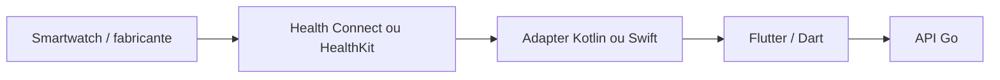

# ADR 0002 — Aplicação mobile multiplataforma

- **Status:** aprovado para fase futura
- **Data:** 22 de julho de 2026
- **Escopo:** decisão arquitetural; `apps/mobile` não é criado na Subfase 2A

## Contexto

A arquitetura inicial previa um aplicativo exclusivamente Android em Kotlin e
Jetpack Compose. O produto passará a atender Android e iOS com a mesma camada
de interface, mantendo acesso nativo às fontes de saúde de cada plataforma.

Health Connect e HealthKit possuem modelos de permissão e disponibilidade
distintos. Esconder essas diferenças em componentes de interface ou em código
de negócio Dart dificultaria consentimento, testes e explicação do sistema.

## Decisão

- O aplicativo futuro fica em `apps/mobile`, com Flutter e Dart para UI,
  navegação, estado e casos de uso do cliente compartilhados.
- Integrações Android que exigem API da plataforma usam Kotlin atrás de um
  adapter/plugin estreito; Health Connect é a primeira fronteira prevista.
- Integrações iOS que exigem API da plataforma usam Swift atrás de um
  adapter/plugin estreito; HealthKit é a primeira fronteira prevista.
- Platform channels carregam DTOs mínimos e versionados. Nenhuma regra de
  autorização, prontidão ou telemetria pertence ao channel nativo.
- Android e iOS usam a mesma API Go e o mesmo contrato OpenAPI. Nenhum cliente
  acessa tabelas PostgreSQL de negócio diretamente.
- O refresh token usa armazenamento seguro por adapter. No Android, o Keystore
  guarda uma chave não exportável e o ciphertext fica no armazenamento privado
  do app; no iOS, o token fica no Apple Keychain. O valor em claro não vai para
  arquivo, preferência comum, log ou telemetria.
- Biometria futura pode liberar o segredo armazenado localmente, mas não
  autentica o usuário perante o servidor e não substitui senha, sessão ou MFA.
- Não haverá aplicativo instalado diretamente em smartwatch no MVP. O relógio
  sincroniza com Health Connect ou HealthKit pelo sistema/aplicativo do
  fabricante no celular; o SysAP lê apenas dados autorizados.



A [documentação de platform channels do Flutter](https://docs.flutter.dev/platform-integration/platform-channels)
prevê Dart falando com Kotlin no Android e Swift no iOS. Health Connect exige
permissões e controles de acesso específicos, conforme a
[documentação Android](https://developer.android.com/health-and-fitness/health-connect/ui/permissions),
e HealthKit exige autorização granular por tipo, conforme a
[documentação Apple](https://developer.apple.com/documentation/HealthKit/authorizing-access-to-health-data).

## Direção de dependências futura

```text
Flutter UI -> application/state -> repositories -> API client
                                  -> health data port
health data port -> Kotlin/Health Connect adapter
                 -> Swift/HealthKit adapter
secure session port -> Android private storage + Keystore key adapter
                    -> Apple Keychain adapter
```

O contrato de cada adapter deve distinguir indisponibilidade, permissão não
solicitada, negada, revogada, dados ausentes e erro temporário. O usuário escolhe
tipos e períodos permitidos; o aplicativo pede somente os dados necessários e
para de sincronizar quando o acesso é revogado.

## Consequências

### Positivas

- Uma interface e um fluxo de autenticação para Android e iOS.
- Código nativo limitado às APIs que realmente exigem a plataforma.
- Health Connect e HealthKit continuam testáveis e substituíveis por fakes.
- O backend e seu modelo de autorização não se duplicam por plataforma.

### Custos e riscos

- Builds, assinatura, publicação e testes continuam específicos por sistema.
- Platform channels exigem contrato e testes nos dois lados.
- As plataformas podem fornecer tipos, histórico e qualidade diferentes; a UI
  deve mostrar disponibilidade real e nunca inventar equivalência.
- A escolha de plugins Flutter de terceiros fica para a fase de implementação,
  com revisão de manutenção, licença, permissões e dependências.

## Alternativas rejeitadas

- Dois aplicativos completos e independentes para Android e iOS.
- Flutter acessando dados de saúde por dependência sem adapter próprio.
- Regra de negócio no Kotlin, Swift ou componente visual.
- Cliente usando diretamente Supabase/PostgreSQL para dados do SysAP.
- Aplicativo de Wear OS ou watchOS no MVP.

## Gates futuros

1. Validar versões suportadas de Flutter, Android e iOS antes do scaffold.
2. Selecionar ou implementar plugins após auditoria de licença/manutenção.
3. Definir DTOs e testes de contrato dos adapters nativos.
4. Validar permissões, revogação e minimização em aparelhos reais.
5. Testar armazenamento seguro e limpeza completa no logout.
