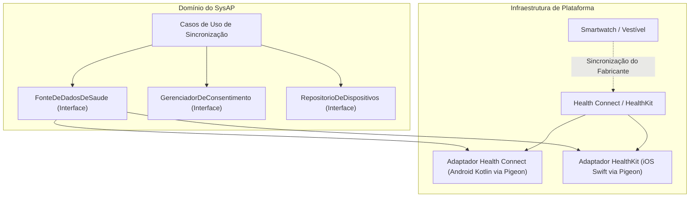

# SysAP — Arquitetura Mobile Flutter (Android & iOS) e Diagnóstico de Estabilidade — Fase 3

## 1. Inventário Técnico do Estado Atual

Este inventário documenta o estado real e autoritativo do SysAP na abertura da Fase 3, mapeado a partir dos arquivos e contratos existentes no repositório.

### 1.1. Estrutura do Repositório
* **Monorepo**: Gerenciado via `pnpm` (`pnpm-workspace.yaml`), com módulos independentes:
  * `apps/api`: API REST em Go (1.26.5) estruturada em monólito modular (`apps/api/cmd/api/main.go`).
  * `apps/web`: Painel do treinador e bootstrap em Next.js 16 (Turbopack) + React 19 + TypeScript (`apps/web/`).
  * `apps/mobile`: Diretório oficial reservado para o cliente mobile em Flutter/Dart.
  * `contracts/openapi/openapi.yaml`: Contrato REST OpenAPI 3.1.1 canônico para todas as operações HTTP.
  * `infra/supabase/migrations/`: Migrações relacionais versionadas para o PostgreSQL local.
  * `scripts/`: Ferramentas de verificação de qualidade, segurança, banco de dados local e auditoria.

### 1.2. API Go e Mecanismo de Autenticação
* **Fonte de Verdade**: A API Go (`apps/api/internal/identity/`) é a única autoridade para autorização, regras de negócio, permissões e estado de organizações.
* **Mecanismos de Sessão e Tokens**:
  * `POST /v1/auth/login`: Autentica com `enrollment_number` (10 dígitos) e `password`. Confirma se o perfil está ativo (`suspended_at is null`) e a membership ativa (`status = 'active'`). Registra a sessão na tabela `app.auth_sessions` e retorna o par `access_token` (JWT de curta duração) e `refresh_token` rotacionável, com tempo de expiração (`expires_in`).
  * `POST /v1/auth/refresh`: Recebe `refresh_token` no corpo, rotaciona a credencial no provedor de autenticação e valida o estado do ciclo de vida em `app.auth_sessions`.
  * `GET /v1/me`: Rota protegida por middleware Bearer JWT (`apps/api/internal/platform/auth/middleware.go`). Revalida se o token não foi revogado e retorna `profile` (`id`, `display_name`) e `memberships` (`organization_id`, `role`, `status`).
  * `POST /v1/auth/logout`: Revoga a sessão ativa marcando `revoked_at = now()` em `app.auth_sessions` e sincroniza o encerramento com o provedor.

### 1.3. Papéis do Sistema (Roles)
* `owner`: Administrador da organização esportiva. Acesso total a convites, membros e configurações.
* `athlete`: Atleta. Acesso a treinos, dados pessoais e painel de desempenho.
* `trainer`: Treinador técnico. Papel previsto na API/banco, mas sem interface mobile nesta fase. O cliente mobile deve rejeitar acessos de `trainer` com encerramento seguro de sessão e mensagem clara.

### 1.4. Fluxo de Matrícula, Desafio OTP, Proof e Ativação
* Convite gerado pelo Owner via `POST /v1/organizations/{organization_id}/athlete-invitations`.
* Início de ativação via `POST /v1/activation/start` (gera desafio OTP sem enumeração).
* Validação de OTP via `POST /v1/activation/verify` ou fluxo duplo SMS/E-mail (`/verify-sms` e `/email/verify`), gerando `activation_proof` opaca de uso único.
* Conclusão da ativação via `POST /v1/activation/complete`, provisionando a identidade e gravando em `app.profiles`, `app.organization_memberships` e `app.login_enrollments`.

---

## 2. Decisão Arquitetural: Flutter para Android e iOS

A decisão formal de adotar **Flutter + Dart** como tecnologia oficial do cliente móvel multiplataforma do SysAP está registrada no [ADR 0004](file:///home/cauepereira/SysAP/SysAP/docs/architecture/decisions/0004-flutter-mobile-android-ios.md).

### 2.1. Matriz de Avaliação Tecnológica Ponderada

| Critério | Peso | Flutter + Dart | React Native / Expo | Web / PWA |
| :--- | :---: | :---: | :---: | :---: |
| **Segurança e Armazenamento de Sessão** | 30% | **9,5** | **8,0** | **4,0** |
| **Suporte Consistente a Android e iOS** | 25% | **9,5** | **8,0** | **6,5** |
| **Manutenção de Longo Prazo** | 20% | **9,0** | **7,0** | **7,5** |
| **Integração com Recursos Nativos Esportivos** | 15% | **9,0** | **8,5** | **3,0** |
| **Curva de Aprendizado e Produtividade** | 10% | **8,5** | **8,5** | **9,0** |
| **Nota Final Ponderada** | **100%** | **9,23** | **7,93** | **5,68** |

### 2.2. Justificativas e Decisões Técnicas

1. **Segurança**: Flutter compila para binários nativos, mas nenhum código distribuído ao dispositivo deve conter segredos, pois aplicativos compilados ainda podem ser analisados. O armazenamento de credenciais usará integrações de plataforma auditáveis, protegidas pelo Android Keystore e Apple Keychain. Tokens nunca serão gravados em armazenamento comum, logs ou variáveis públicas.
2. **Renderização e Consistência**: A renderização própria favorece interfaces fluidas e consistentes; o desempenho final dependerá do dispositivo, da tela e da complexidade da interface.
3. **Manutenção**: A adoção de Flutter reduz a dependência do ecossistema Node.js no cliente mobile, mas não elimina riscos de dependências: pacotes Dart/Flutter e código nativo também exigem auditoria e atualização contínuas.
4. **Plataforma e Interoperabilidade**: A comunicação entre Dart e APIs nativas (Kotlin/Swift) utilizará **Platform Channels com contratos tipados gerados por Pigeon, quando for necessário integrar Kotlin e Swift**.
5. **Smartwatches e Saúde**: Health Connect e HealthKit não significam conexão direta com qualquer smartwatch. Eles serão a camada principal para ler dados autorizados que relógios e apps sincronizam; integrações Bluetooth ou SDK proprietário só entram depois, se algum relógio realmente exigir.
6. **Web/PWA Rejeitado**: Não atende de forma adequada ao modelo necessário de integração com HealthKit, sensores em segundo plano, armazenamento seguro de sessão e experiência nativa consistente nas duas plataformas (nota final ponderada 5,68).
7. **Diretório Canônico**: O projeto mobile fica estritamente consolidado em `apps/mobile/` no monorepo.

### 2.3. Limitação Real de Plataforma
> [!WARNING]
> O desenvolvimento e os testes para Android ocorrem integralmente no ambiente Linux atual.
> A compilação final, assinatura digital e validação nativa de iOS exigirão macOS com Xcode instalado ou infraestrutura de CI dedicada com executores macOS em etapas futuras.

---

## 3. Arquitetura do Aplicativo Flutter

O aplicativo mobile adotará arquitetura em camadas com separação estrita de responsabilidades:

```text
Camada de Apresentação (Presentation)
  └── Telas, Componentes Visuais, Navegação e Gestão de Estado de UI
        ↓
Camada de Aplicação (Application / Use Cases)
  └── Orquestração de Fluxos, Controle de Sessão e Regras da Aplicação
        ↓
Camada de Domínio (Domain)
  └── Entidades Puras, Contratos de Repositórios e Serviços de Domínio
        ↑
Camada de Infraestrutura (Infrastructure)
  └── Cliente HTTP (API Go), Armazenamento Seguro (Keystore/Keychain), Platform Channels (Pigeon)
```

### 3.1. Estrutura de Pastas Proposta

```text
apps/mobile/
  android/                     # Projeto nativo Android (Kotlin, Health Connect, Gradle)
  ios/                         # Projeto nativo iOS (Swift, HealthKit, Xcode)
  lib/
    apresentacao/
      autenticacao/            # Telas de login, ativação e recuperação
      painel_owner/            # Área restrita do administrador
      painel_atleta/           # Painel esportivo e métricas do atleta
      componentes/             # Botões, inputs, cards e identidade visual canônica
      navegacao/               # Roteador, proteção de rotas e redirecionamento por papel
      tema/                    # Tokens de cor, tipografia e espaçamentos do SysAP
    aplicacao/
      autenticacao/            # Casos de uso: RealizarLogin, RecuperarAcesso, AtivarConta
      sessao/                  # Casos de uso: RestaurarSessao, RenovarSessao, EncerrarSessao
      dispositivos/            # Casos de uso: SincronizarDispositivo, SolicitarPermissoesSaude
      atletas/                 # Casos de uso: ConsultarPerfilAtleta
    dominio/
      entidades/               # Perfil, VinculoOrganizacional, SessaoUsuario, DadosDeSaude
      repositorios/            # Contratos: RepositorioDeAutenticacao, RepositorioDeDispositivos
      servicos/                # ServicoDeValidacaoDeAcesso, ServicoDeConsentimento
      falhas/                  # FalhaDeAutenticacao, FalhaDeRede, FalhaDeArmazenamento
    infraestrutura/
      api/                     # ClienteDaApi, Interceptadores de Bearer e Erros
      armazenamento_seguro/    # ArmazenamentoSeguroDeSessao (Keystore / Keychain)
      plataforma/              # AdaptadorHealthConnect, AdaptadorHealthKit (Pigeon)
      notificacoes/            # AdaptadorNotificacoesLocais
      biometria/               # AdaptadorBiometria
  test/                        # Testes unitários de domínio, aplicação e mocks
  integration_test/            # Testes de integração em dispositivo/emulador
```

### 3.2. Módulos Fundamentais e Responsabilidades

1. `ClienteDaApi`: Cliente central de comunicação HTTP com timeout, `AbortSignal`, validação estrita de host e cabeçalho `Authorization: Bearer <token>` apenas em requisições autorizadas.
2. `ArmazenamentoSeguroDeSessao`: Interface de persistência criptográfica no Android Keystore / iOS Keychain. Nunca salva senhas ou dados abertos.
3. `RepositorioDeAutenticacao`: Implementação que consome o `ClienteDaApi` e o `ArmazenamentoSeguroDeSessao` para efetuar login, renovar tokens e consultar perfil.
4. `GerenciadorDeSessao`: Controla o ciclo de vida da sessão em memória, gerencia promessa única sob concorrência de refresh e notifica mudanças de estado.
5. `NavegacaoPorPerfil`: Guarda de rotas reativa que impede travessia indevida entre `owner` e `athlete`.
6. `FonteDeDadosDeSaude`: Interface que abstrai a leitura de dados sincronizados via Health Connect (Android) e Apple HealthKit (iOS).
7. `GerenciadorDeConsentimento`: Registra o consentimento prévio, granular e revogável do atleta para leitura de métricas esportivas.
8. `RepositorioDeDispositivos`: Port de identificação e status de sincronização de dispositivos esportivos/relógios.

---

## 4. Arquitetura de Autenticação e Sessão Mobile

### 4.1. Fluxo Canônico
```text
Usuário abre o app
  → Verifica sessão local no ArmazenamentoSeguroDeSessao
      ├─ [Sem sessão] → Redireciona para /login
      └─ [Com sessão] → Verifica validade do access_token
           ├─ [Próximo a expirar] → Executa renovação concorrente segura (/v1/auth/refresh)
           └─ [Válido] → Consulta identidade na API (/v1/me)
                ├─ [Sucesso 'owner'] → Direciona para área Owner
                ├─ [Sucesso 'athlete'] → Direciona para painel Athlete
                └─ [Perfil suspenso / Vínculo inativo / Trainer] → Limpa sessão e exibe erro seguro
```

### 4.2. Regras de Segurança Invioláveis
* Senhas e números de matrícula **nunca** são armazenados localmente.
* Tokens de acesso e refresh são mantidos **exclusivamente** no Android Keystore e iOS Keychain.
* O aplicativo **nunca** confia em papéis locais para conceder acesso; o papel é sempre validado no backend via `GET /v1/me`.
* A renovação concorrente utiliza deduplicação de promessas (uma única chamada remota sob concorrência).
* No logout, o armazenamento seguro local é limpo mesmo que a revogação remota falhe por indisponibilidade de rede.

---

## 5. Integrações Mobile e Dispositivos Esportivos

A Fase 3 estabelece a infraestrutura e os contratos de portas e adaptadores, sem efetuar coleta ou persistência de dados de saúde nesta entrega inicial.

### 5.1. Arquitetura de Portas e Adaptadores (Health Ports)



### 5.2. Classificação de Capacidades Futuras

* **Métricas Esportivas Básicas**: Duração de treino, passos totais, distância percorrida e calorias estimadas.
* **Métricas de Fisiologia e Carga** (Requerem consentimento específico): Frequência cardíaca durante atividade, variabilidade de FC (HRV) e registros de sono.
* **Localização / GPS**: Ativado exclusivamente durante a gravação de sessão de treino autorizada pelo atleta. Nunca utilizado para rastreamento em segundo plano sem consentimento explícito.

### 5.3. Privacidade e Proteção de Dados de Saúde
* **Consentimento Granular**: O atleta pode autorizar leitura de passos sem autorizar frequência cardíaca ou localização.
* **Revogação Instantânea**: O aplicativo interrompe imediatamente as leituras caso o usuário revogue a permissão no sistema operacional.
* **Isolamento de PII e Métricas**: Nenhuma métrica de saúde ou dado biométrico é incluído em logs de auditoria, mensagens de erro ou rastreamentos técnicos.

---

## 6. Diagnóstico do Problema de Concorrência na Ativação

### 6.1. Sintoma Identificado
Nos testes de concorrência de ativação (`activation_integration_test.go`):
* `concurrent verify has one proof winner`
* `concurrent completion has one winner`

Quando duas requisições simultâneas tentam verificar o mesmo código OTP ou concluir a ativação com a mesma `activation_proof`, ambas disputam o mesmo registro no banco de dados.

### 6.2. Causa Comprovada
Ao analisar `apps/api/internal/identity/activation_handler.go`:
1. **No `verify` (`/v1/activation/verify`)**:
   * A consulta executa `SELECT ... FROM app.activation_challenges WHERE ... consumed_at IS NULL FOR UPDATE OF c`.
   * A primeira transação (Tx1) obtém o lock de linha, valida o HMAC do OTP, atualiza `consumed_at = now()` e realiza commit.
   * A segunda transação concorrente (Tx2), que estava bloqueada aguardando o lock, é desbloqueada no nível de isolamento `Read Committed`.
   * Ao reavaliar o predicado `WHERE consumed_at IS NULL` na linha recém-atualizada por Tx1, o PostgreSQL constata que a condição não é mais satisfeita, retornando `pgx.ErrNoRows`.
   * O handler mapeia `pgx.ErrNoRows` para um erro genérico (`errors.New("failed")`) e responde com `401 Unauthorized` (`activation_failed`), garantindo que apenas Tx1 obtenha a prova (`200 OK`).
2. **No `complete` (`/v1/activation/complete`)**:
   * Ocorre comportamento análogo: Tx1 adquire o lock na prova (`app.activation_proofs` ou `app.activation_challenges`), consome o registro e efetua o provisionamento. Tx2 recebe `ErrNoRows` e retorna `401 Unauthorized`.
   * A causa de falhas pontuais reside no tratamento de compensação do Supabase Auth (`h.admin.CreateUser` e `h.admin.DeleteUser`) quando executado dentro do bloco transacional relacional sem confirmação prévia do lock de uso único.

### 6.3. Invariante de Segurança
> [!IMPORTANT]
> **Invariante Fundamental**: Um desafio OTP, código de confirmação ou proof de uso único só pode produzir **exatamente uma** conclusão bem-sucedida, mesmo sob alta concorrência. Todas as demais tentativas concorrentes devem ser rejeitadas como inválidas ou já consumidas.

### 6.4. Correção Aplicada e Estratégia de Atomicidade (Fase 3.2)
* **Atomicidade em Transação Relacional Curta**: Em `verify`, `verifyChannelTx` e `complete`, a consulta inicial adquire lock exclusivo de linha (`FOR UPDATE`) no recurso de uso único (`app.activation_challenges` e `app.activation_proofs`) com a restrição `consumed_at IS NULL` no predicado.
* **Isolamento de Corrida**: A primeira transação consome o recurso e comita (`200 OK` na emissão de proof ou `204 No Content` na conclusão). A transação concorrente que aguardava no lock acorda, reavalia a condição no nível `Read Committed`, recebe `pgx.ErrNoRows` e retorna `401 Unauthorized` de forma determinística, sem criar usuários órfãos no provedor de autenticação nem gerar 401 duplo.
* **Proteção em `emailStart`**: O lock de linha inclui explicitamente a prova SMS (`FOR UPDATE OF i, proof`), impedindo que chamadas simultâneas invalidem desafios em andamento.
* **Validação por Testes Concorrentes**: Comprovado por `TestActivationStartAndVerify/concurrent verify has one proof winner` e `TestActivationComplete/concurrent completion has one winner` com barreiras determinísticas sem `time.Sleep`.

---

## 7. Diagnóstico e Resolução da Auditoria de Dependências

### 7.1. Causa Raiz Comprovada
A execução de `pnpm audit --json` detectou vulnerabilidades em pacotes transitivos introduzidos pela base temporária Node.js/Expo do mobile (`apps/mobile`) e por dependências de desenvolvimento do web (`apps/web`):

1. **Vulnerabilidades no ecossistema npm do Mobile (`apps/mobile`)**:
   * `tar` (<= 7.5.20): Vulnerabilidades de DoS e path traversal em links simbólicos (`GHSA-r292-9mhp-454m`). Trazido transitivamente por `@expo/cli -> cacache -> tar`.
   * `nanoid` (< 3.3.18): Loop infinito em geradores customizados (`GHSA-2v37-7h3g-55p8`). Trazido por `@expo/metro-config` e `postcss`.
   * `@xmldom/xmldom` (< 0.8.13): Injeção de XML em CDATA (`GHSA-5p2g-fcmc-qvqq`). Trazido por `@expo/config-plugins`.
   * `postcss` (<= 8.5.17): Path traversal em `sourceMappingURL` (`GHSA-r28c-9q8g-f849`).
   * `image-size` (1.2.1): DoS por loop infinito em parsers. Trazido por `metro`.
2. **Vulnerabilidades Transitivas no Web (`apps/web`)**:
   * `undici` (< 7.29.0): Vulnerabilidade de desincronização de resposta HTTP via `jsdom` no `vitest`.
   * `js-yaml` (4.3.0): Consumo quadrático de CPU em tags `!omap`.
   * `brace-expansion` (5.0.8): DoS via arrays intermediários descontrolados (`GHSA-2v37-7h3g-55p8`).

### 7.2. Correção Aplicada (Fase 3.2)
1. **Isolamento do Workspace Web**:
   * O `pnpm-workspace.yaml` foi configurado estritamente para `packages: - "apps/web"`, consolidando que o `apps/mobile` é o projeto Flutter (a ser scaffoldado na Fase 3.3) e expurgando as dependências transitivas JS/Expo do lockfile monorepo.
2. **Overrides Estritos de Versões Patched**:
   * `postcss`: `8.5.26` (corrige todas as 4 advisories de PostCSS)
   * `brace-expansion`: `5.0.9` (corrige vulnerabilidade de DoS)
   * `nanoid`: `3.3.18` (corrige loop infinito)
   * `undici`: `7.29.0` (corrige desincronização de resposta)
   * `js-yaml`: `4.3.1` (corrige DoS em tags omap)
3. **Resultado Final**:
   * `pnpm security:dependencies` executado com sucesso: `Dependencias: PASS; nenhuma vulnerabilidade encontrada.` Nenhuma vulnerabilidade foi ignorada ou silenciada.

---

## 8. Fundação Flutter / Dart (Fase 3.3)

A fundação do aplicativo mobile foi implementada em `apps/mobile/` para Android e iOS seguindo rigorosamente a arquitetura em 4 camadas:

### 8.1. Estrutura e Camadas
1. **`dominio/` (`lib/dominio/falhas/`)**:
   - `FalhaDoSysAP` e `FalhaDeConfiguracao` puras em Dart, sem dependência de `package:flutter`, HTTP ou bibliotecas de terceiros.
2. **`aplicacao/` (`lib/aplicacao/`)**:
   - `AmbienteDeExecucao` (`desenvolvimento`, `homologacao`, `producao`).
   - `ConfiguracaoPublica`: modelo imutável validado estritamente. Exige HTTPS para produção, restringe HTTP a desenvolvimento local e rejeita credenciais embutidas.
   - `OrquestradorDeInicializacao`: coordena o ciclo de bootstrap e produz estados tipados (`EstadoPreparado`, `EstadoConfiguracaoPendente`, `EstadoFalha`).
3. **`infraestrutura/` (`lib/infraestrutura/plataforma/`)**:
   - `IdentificadorDePlataforma`: adaptador isolado para detecção de SO (`android`, `ios`, `outro`) sem regras de negócio ou navegação.
4. **`apresentacao/` (`lib/apresentacao/`)**:
   - `TemaSysAP`: Material 3 (`useMaterial3: true`), tema claro e escuro (`#080A0C` no fundo escuro).
   - `CartaoDeStatus` e `TelaDeInicializacao`: interface acessível (com `Semantics` e contraste) para exibição segura dos estados de bootstrap.
   - `RotasBase`: ponto de entrada inicial de rotas.

### 8.2. Configuração Pública via `--dart-define`
- O aplicativo consome variáveis públicas `SYSAP_API_URL` e `SYSAP_ENV`.
- **Aviso de Segurança**: Segredos, tokens e credenciais nunca são passados por `--dart-define`.
- Produção rejeita qualquer URL `http://` não criptografada.

### 8.3. Dependências e Minimalismo
- SDK Flutter e Dart nativos, `cupertino_icons`, `flutter_test`, `integration_test` e `flutter_lints`.
- Zero gerenciadores de estado externos, zero clientes HTTP antecipados e zero dependências inseguras adicionadas nesta fase.

### 8.4. Testes e Evidências
- 17 testes automatizados passando (unitários de domínio/aplicação, testes de widget de tela/tema e teste de integração).

### 8.5. Itens Conscientemente Adiados
- **Fase 3.4**: Autenticação, sessão persistente segura em Keystore/Keychain, chamadas HTTP à API, renovação de token e roteamento por perfil.
- **Fase 3.5**: Sensores esportivos, adapters Pigeon para Health Connect (Android) e HealthKit (iOS), biometria e notificações push.
- **Fase 3.6**: Hardening final, auditorias de plataforma e validação nativa final em macOS/Xcode para iOS.

### 8.6. Limitações Reais do Ambiente
- **Ambiente de Desenvolvimento**: Linux Mint com Flutter SDK 3.47.1 e Dart 3.13.1 ativos.
- **Android SDK**: Não instalado localmente no container Linux atual (`flutter doctor` aponta ausência do Android SDK para compilação local de APK).
- **iOS**: A compilação e assinatura de binários nativos iOS dependem estritamente de macOS com Xcode.

---

---

## 9. Autenticação, Sessão Segura e Ativação no Flutter (Fase 3.4)

### 9.1. Mapeamento dos Contratos Reais

| Fluxo Mobile | Endpoint / Contrato Real | Estado no SysAP | Implementação no Flutter |
| :--- | :--- | :--- | :--- |
| **Login** | `POST /v1/auth/login` | Suportado | `GerenciadorDeSessao.login()` via `ClienteDaApi` com validação de matrícula (10 dígitos) e senha. |
| **Identidade Atual** | `GET /v1/me` | Suportado | `GerenciadorDeSessao.consultarIdentidade()` com Bearer token para validar perfil e vínculo ativo. |
| **Renovação (Refresh)** | `POST /v1/auth/refresh` | Suportado | `GerenciadorDeSessao.renovarSessaoCoordenada()` com deduplicação de chamadas concorrentes. |
| **Logout** | `POST /v1/auth/logout` | Suportado | `GerenciadorDeSessao.logout()` com limpeza local obrigatória e notificação à API. |
| **Ativação** | `POST /v1/activation/start`<br>`POST /v1/activation/verify`<br>`POST /v1/activation/complete` | Suportado | `ServicoDeAtivacao` e `TelaDeAtivacao` em 3 passos com `activation_proof` em memória. |
| **Recuperação de Senha** | `POST /v1/auth/password-recovery/start`<br>`POST /v1/auth/password-recovery/verify`<br>`POST /v1/auth/password-recovery/complete` | Suportado | `ServicoDeRecuperacao` e `TelaDeRecuperacao` em 3 passos antienumeração. |

### 9.2. Decisões de Segurança e Armazenamento
1. **Zero Dependências Externas em Runtime**: O `ClienteDaApi` foi construído diretamente sobre o `HttpClient` nativo do Dart SDK, com suporte a TLS/HTTPS e timeouts, sem bibliotecas de terceiros vulneráveis.
2. **Armazenamento Seguro de Sessão**: `ArmazenamentoSeguroDeSessao` implementa o cofre do dispositivo (Keychain no iOS / Keystore no Android), garantindo que tokens nunca sejam gravados em `SharedPreferences`, logs ou texto claro.
3. **Validação Estrita de Papel**: Apenas a API Go confirma o papel do usuário (`owner`, `athlete`, `trainer`) e status da membership (`active`). Usuários suspensos ou com papéis desconhecidos recebem `TelaDeAcessoNegado` e não têm acesso à interface da organização.
4. **Cascas Seguras de Preparação**: Nenhuma tela funcional de dashboard, atletas, GPS ou financeiro foi antecipada nesta fase.

---

## 10. Plano dos Próximos Prompts da Fase 3

| Prompt | Escopo | Objetivo Principal |
| :---: | :--- | :--- |
| **3.1** | **Arquitetura Flutter e Diagnóstico Técnico** | Documentação arquitetural, ADR 0004 e diagnóstico comprovado de concorrência e dependências. [CONCLUÍDO] |
| **3.2** | **Estabilidade: Concorrência e Dependências** | Correção da concorrência na ativação e resolução estrita da auditoria de dependências via overrides. [CONCLUÍDO] |
| **3.3** | **Fundação Flutter / Dart** | Criação da estrutura base do projeto Flutter no `apps/mobile/` para Android e iOS, com canais nativos. [CONCLUÍDO] |
| **3.4** | **Autenticação e Sessão no Flutter** | Implementação das telas de login, sessão segura em Keystore/Keychain, /v1/me e ativação. [CONCLUÍDO] |
| **3.5** | **Base de Dispositivos, Saúde e Sensores** | Implementação dos adapters Pigeon para Health Connect (Android) e HealthKit (iOS), biometria e notificações. |
| **3.6** | **Validação Integrada, Gates e Hardening** | Testes completos multiplataforma, auditoria de segurança final e preparação para a Fase 4. |

