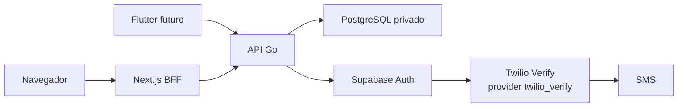

# Fase 2 — Identidade, organizações e acesso

- **Status:** arquitetura aprovada; implementação ainda não iniciada
- **Subfase atual:** 2A — documentação e contrato OpenAPI
- **Data:** 22 de julho de 2026

Este plano é a fonte de execução da Fase 2. Ele não cria autenticação, tabela,
migration, provider, conta externa ou aplicação mobile. As decisões detalhadas
estão no [ADR de identidade](../architecture/decisions/0001-phase-2-identity.md),
no [ADR mobile](../architecture/decisions/0002-cross-platform-mobile.md), no
[modelo de ameaças](../security/auth-threat-model.md) e no
[plano adversarial](../security/auth-adversarial-test-plan.md).

## 1. Resultado esperado

Ao fim da Fase 2, o SysAP terá:

- organização e memberships isolados por tenant;
- papéis `owner`, `trainer` e `athlete` com autorização server-side;
- pré-cadastro de atleta por staff autenticado;
- matrícula pública de dez dígitos, distinta da identidade Auth;
- ativação e recuperação de atleta por OTP SMS para identidade já criada;
- senha, tokens, MFA e sessões gerenciados pelo Supabase Auth;
- login de atleta por matrícula e senha;
- login de staff por email, senha e TOTP antes de emitir sessão utilizável;
- refresh, logout, logout global, suspensão imediata e auditoria;
- contrato único para o Next.js BFF e o futuro Flutter;
- nenhuma criação pública de organização, staff ou atleta.

## 2. Arquitetura final



Clientes nunca acessam tabelas de negócio. O BFF e o mobile também não recebem
secret key, `service_role`, conexão do banco ou credencial Twilio. O provider
Twilio não aparece no contrato HTTP: falhas são traduzidas para estados e erros
seguros da API.

### Responsabilidades

| Componente | Responsabilidades | Não faz |
|---|---|---|
| Web Next.js | BFF server-side, cookie seguro, CSRF/Origin, UI em português | Não guarda token em Web Storage, não autoriza, não acessa tabela. |
| Flutter futuro | UI compartilhada, sessão via storage seguro e API Go | Não contém regra de papel nem credencial administrativa. |
| API Go | casos de uso, matrícula, organização, autorização, rate limit, idempotência, mensagens seguras e auditoria | Não cria hash/JWT/OTP, não chama Twilio diretamente. |
| PostgreSQL | entidades privadas, unicidade, estado, transações, outbox, auditoria, grants e RLS adicional | Não autentica senha nem envia SMS. |
| Supabase Auth | `auth.users`, senha/hash, OTP, TOTP, JWT, refresh e revogação | Não decide papel, tenant ou suspensão do SysAP. |
| Twilio Verify | entrega/verificação SMS conforme configuração do Supabase | Não recebe regra de negócio e não é chamado por clientes/API. |

## 3. Fronteiras do monólito Go

A direção conceitual é `http -> application -> domain/ports -> adapters`.
`platform` mantém apenas servidor HTTP, configuração, logging e banco genérico.
Handlers validam transporte e chamam casos de uso; não contêm regra de negócio.

```text
apps/api/internal/identity/
  domain/                 entidades, estados, invariantes e erros
  application/            casos de uso e coordenação
  ports/                  contratos estreitos
  postgres/               repositórios e transações
  http/                   handlers e DTOs

apps/api/internal/integrations/
  supabaseauth/            identidade, senha, token, OTP, TOTP e seam de SMS
```

Portas conceituais:

- `IdentityProvider`: provisionar identidade, pedir/verificar OTP, definir
  senha, autenticar, renovar e revogar sessão;
- `TokenVerifier`: verificar JWT e claims técnicos permitidos;
- `SessionRegistry`: registrar `session_id`, negar revogados e aplicar corte por
  sujeito sem persistir bearer tokens;
- `MFAChallengeStore`: guardar digest/metadados do ticket e material AAL1
  cifrado com TTL/consumo atômico;
- `SMSProvider`: capacidade substituível de entrega; na primeira implementação
  fica encapsulada pelo `IdentityProvider` do Supabase, nunca é chamada pelo
  domínio nem implementada com SDK Twilio na API. O pacote `integrations/sms`
  sugerido inicialmente não será criado; provider fora do Supabase exige novo
  ADR;
- `EnrollmentNumberGenerator`: ano Fortaleza + CSPRNG;
- `Clock`: instantes UTC e testes determinísticos;
- `RateLimiter`: limites combinados e `Retry-After`;
- `SecurityAuditWriter`: eventos por allowlist;
- `TransactionManager`: transação curta para entidade, estado, auditoria e
  outbox. O nome explícito é preferido a um `UnitOfWork` genérico.

Essa organização segue o uso de `internal` e pacotes coesos descrito em
[Organizing a Go module](https://go.dev/doc/modules/layout); a direção de
dependências é uma decisão do SysAP.

## 4. Fluxos completos

### 4.1 Pré-cadastro e ativação do atleta

1. `owner` ou `trainer` ativo e com AAL2 envia nome, nascimento e telefone para
   a API com Idempotency-Key e seleciona a organização em
   `X-Organization-ID`.
2. A API limita a requisição e trata o header apenas como seletor não
   confiável: exige membership ativa naquele UUID e deriva papel/escopo do
   PostgreSQL. O header nunca concede acesso por si só.
3. PostgreSQL cria convite, reserva matrícula e grava outbox/auditoria em uma
   transação; nenhum SMS é enviado nela.
4. O adapter administrativo provisiona uma identidade técnica opaca no
   Supabase Auth sem senha inicial.
5. O reconciliador confirma o vínculo privado e muda o convite para
   `pending_activation`.
6. A API pede OTP apenas para essa identidade. Supabase Auth usa
   `twilio_verify` somente no ambiente autorizado.
7. O atleta envia matrícula, OTP e sua própria senha.
8. A API aplica limites antes da resolução, Supabase verifica OTP e administra
   a senha; o convite passa por `activation_finalizing`, PostgreSQL ativa a
   membership e conclui o convite como `accepted` de forma idempotente.
9. A ativação responde sem sessão. O atleta faz login explícito com matrícula e
   senha, evitando reter/repetir tokens em resposta idempotente.

Se a verificação OTP do Supabase emitir sessão, ela permanece transitória e
server-only, não é devolvida/persistida e é revogada após concluir senha/estado.
A API não aceita sessão autenticada apenas por OTP em rotas de negócio; método
de autenticação/assurance permitido é validado antes da autorização. A 2C/2E
deve provar os claims/metadados e a revogação efetivamente disponíveis.

Antes da atualização externa da senha, o estado local
`activation_finalizing` é confirmado. Se Auth aceitar a senha e o commit final
falhar, o reconciliador consulta apenas estado não secreto; quando essa consulta
não for conclusiva, o primeiro login válido com a nova senha finaliza a
membership. OTP e senha nunca são armazenados para retry. Se a senha não tiver
sido atualizada, o atleta precisa de novo desafio OTP.

### 4.2 Login do atleta

1. Receber matrícula e senha, sem telefone ou identificador Auth.
2. Aplicar limites por IP e HMAC de matrícula antes da consulta sensível.
3. Resolver matrícula para identificador técnico opaco; usar um identificador
   fictício constante se não existir.
4. Pedir ao Supabase Auth a verificação de senha.
5. Manter a sessão recém-criada sob custódia server-only e consultar
   membership, organização e estado no PostgreSQL.
6. Registrar o `session_id` e emitir sessão somente se todos os passos
   passarem; em qualquer negação, revogar a sessão técnica e responder
   `authentication_failed`, sem dizer se matrícula, senha, vínculo, tenant ou
   suspensão falhou.

### 4.3 Login e MFA de staff

O identificador de login inicial de `owner` e `trainer` será email provisionado
por operação autorizada; não existe signup público. A API recebe email e senha,
Supabase Auth cria uma sessão AAL1 sob custódia exclusiva da API. Depois da
checagem local, o login retorna somente ticket MFA CSPRNG de pelo menos 256 bits,
com TTL de cinco minutos. Apenas digest HMAC de finalidade separada, sujeito,
`session_id`, finalidade, tentativas, expiração e `consumed_at` ficam em
`auth_challenges`. No ticket `purpose=enroll`, fator/desafio são nulos; após
criar o fator, esse ticket é consumido e o novo `purpose=verify` exige ambos por
constraint condicional. O access token AAL1 necessário ao Auth fica na mesma
tabela por no máximo cinco minutos, cifrado por AEAD com nonce único, dados
associados de sujeito/sessão/finalidade e chave versionada no gerenciador de
segredos. Assim qualquer instância pode consumi-lo atomicamente após restart.
O ciphertext é apagado ao consumir/expirar; não se persiste refresh técnico.

`POST /v1/auth/staff/mfa/verify` recebe ticket e TOTP. A API limita tentativas,
consome o ticket uma única vez em transação, revalida a membership e só então
entrega a sessão AAL2. Ticket, token AAL1, QR, segredo TOTP e código nunca entram
em log/auditoria; desafios abandonados são revogados e limpos.

Não foram criados endpoints MFA sob `/memberships/{id}`: aceitar um membership
antes de concluir a autenticação ampliaria enumeração e IDOR. IDs externos de
factor/challenge também não são expostos. O primeiro owner é provisionado por
procedimento operacional auditado e não possui senha padrão. Owner/trainer
provisionado passa por bootstrap AAL1, escolhe senha e faz enrollment TOTP pelo
BFF em `POST /v1/auth/staff/mfa/enroll`; QR/segredo usa `no-store`, fica visível
apenas ao próprio staff e é confirmado pelo endpoint `/mfa/verify` antes de sua
membership ficar ativa. Troca e recuperação assistida do fator são entregas
bloqueantes da 2F; nenhuma conta de staff entra em uso antes disso.

### 4.4 Refresh, logout e suspensão

- Refresh token é enviado somente pelo BFF server-side ou mobile seguro. A API
  delega rotação ao Supabase e retorna o novo par pelo canal protegido.
- Refresh usa single-flight por sessão no BFF/mobile e troca atômica do par; não
  persiste resposta nem usa Idempotency-Key, pois isso duplicaria tokens. Retry
  segue a janela de reuse comprovada do Supabase.
- Logout marca `session_id` como revogado no SysAP antes do sign-out e apaga o
  segredo local; logout global grava um corte por sujeito e revoga todas as
  sessões conhecidas. O sign-out isolado bloquearia refresh, mas access JWT
  seguiria válido até `exp`, por isso toda rota protegida consulta o registro
  local de sessão.
- Após o primeiro logout global `204`, retry com o mesmo bearer já revogado pode
  receber `401`; o cliente considera ambos terminais e sempre remove o material
  local. Não existe replay idempotente autenticado depois do corte.
- Suspensão muda o estado autoritativo, invalida cache, pede revogação global e
  passa a negar toda rota protegida, inclusive com access token não expirado.

### 4.5 Recuperação

A recuperação pública da Fase 2 é somente para atleta: matrícula -> resposta
sempre `202` -> OTP no telefone previamente vinculado -> matrícula, OTP e nova
senha -> `204` -> login explícito. Não recebe telefone novo e não revela envio.
Antes de alterar a senha externamente, o SysAP confirma uma
`identity_operations` de finalidade `account_recovery` em `processing` e o corte
das sessões anteriores. Se a atualização Auth vencer e o commit final falhar,
o login com a nova senha consome/conclui essa operação como `succeeded` e grava
a auditoria sem reapresentar OTP/senha; o reconciliador mantém os tokens antigos
negados. `failed` só é gravado quando o Auth comprova que não atualizou a senha.
Todas as sessões anteriores são revogadas.

Recuperação de staff é procedimento assistido com prova de identidade, revisão
de owner/operador e novo enrollment TOTP; não reutiliza SMS como segundo fator
e não possui endpoint público nesta fase.

## 5. Matrícula e identidade Auth

- formato: `YYYYNNNNNN`, exatamente dez dígitos;
- `YYYY`: ano do cadastro em `America/Fortaleza`;
- `NNNNNN`: CSPRNG no servidor, incluindo zeros à esquerda;
- unicidade global por constraint/índice; retry de colisão limitado;
- nunca derivada de PII, nunca reutilizada e sempre representada como string;
- exemplo documental permitido: `2026000001`.

O identificador Auth é aleatório, opaco, privado e não derivado. Ele nunca é
campo de domínio, URL ou parâmetro de autorização. Como o access JWT Supabase
carrega o sujeito em `sub`, seu portador pode tecnicamente vê-lo; clientes
tratam o JWT como credencial opaca e jamais exibem ou usam esse valor como ID de
negócio. A representação exata será provada no início da 2B. Matrícula não é
senha nem identificador de `auth.users`.

## 6. Papéis e autorização

- `owner`: administra organização, trainers, papéis e auditoria;
- `trainer`: cadastra e acompanha atletas que criou ou que um owner lhe atribuiu
  explicitamente dentro da organização;
- `athlete`: acessa somente o próprio perfil/dados;
- primeiro owner: procedimento operacional seguro, sem usuário/senha padrão;
- owner e trainer: TOTP/AAL2 antes de qualquer ação privilegiada;
- papel, tenant, AAL e estado são confirmados pela API, nunca pelo payload.

Legenda: `sim` exige conta ativa e mesma organização; `AAL2` acrescenta TOTP;
`próprio` limita ao próprio sujeito; `operacional` não possui endpoint público.

| Operação | Owner | Trainer | Athlete | Não autenticado | Outra organização | Suspenso |
|---|---|---|---|---|---|---|
| Criar organização | operacional | não | não | não | não | não |
| Convidar trainer | AAL2 | não | não | não | não | não |
| Cadastrar atleta | AAL2 | AAL2 | não | não | não | não |
| Reenviar ativação | AAL2 | AAL2 | não | não | não | não |
| Cancelar convite | AAL2 | AAL2 | não | não | não | não |
| Consultar matrícula | sim | sim | próprio | não | não | não |
| Suspender atleta | AAL2 | AAL2 | não | não | não | não |
| Reativar atleta | AAL2 | AAL2 | não | não | não | não |
| Encerrar sessões | AAL2 no tenant | AAL2 de atleta autorizado | próprio | não | não | não |
| Consultar próprio perfil | sim | sim | próprio | não | não | não |
| Consultar outro atleta | sim | autorizado | não | não | não | não |
| Alterar papel | AAL2 | não | não | não | não | não |
| Consultar auditoria | AAL2 | não | não | não | não | não |

Trainer nunca administra owner/trainer nem muda seu próprio escopo. A 2B cria a
relação explícita trainer-atleta: o criador recebe atribuição automática e owner
pode atribuir/remover outros trainers; owner enxerga todos os atletas do tenant.
A mesma transação que demove, suspende ou encerra owner bloqueia a operação se
ele for o último owner ativo da organização, com lock que evite corrida.

Staff pode ter memberships em várias organizações. Operações sem recurso na URL
usam `X-Organization-ID` como seleção não confiável e a API exige membership
ativa correspondente; IDs de recursos são sempre reescopados ao tenant. Data de
nascimento não cria relação de responsável: consentimento/representação de
menor exige validação jurídica e modelagem própria antes de dados reais. Para
recurso inexistente ou de outra organização, a resposta protegida é a mesma
`404`; `403` indica apenas falta de capacidade no contexto já autenticado.

## 7. Modelo de estados e consistência

Cada estado tem um único proprietário persistente; não existe enum misto.

| Entidade | Estado | Saídas permitidas |
|---|---|---|
| Convite | `pending_provisioning` | `pending_activation`, `provisioning_failed`, `cancelled`, `expired` |
| Convite | `provisioning_failed` | `pending_provisioning`, `cancelled` |
| Convite | `pending_activation` | `activation_finalizing`, `cancelled`, `expired` |
| Convite | `activation_finalizing` | `accepted`; `pending_activation` somente se Auth provar que a senha não foi atualizada e novo desafio for exigido |
| Convite | `accepted`, `cancelled`, `expired` | nenhuma; terminais |
| Operação de identidade | `pending` | `processing` |
| Operação de identidade | `processing` | `succeeded`, `failed` |
| Operação de identidade | `failed` | `pending` apenas por retry autorizado |
| Operação de identidade | `succeeded` | nenhuma; terminal |
| Membership | `pending_activation` | `active`, `closed` |
| Membership | `active` | `suspended`, `closed` |
| Membership | `suspended` | `active`, `closed` |
| Membership | `closed` | nenhuma; terminal e sessões negadas |

O OpenAPI de convite expõe só estados do convite. `/me` e a alteração de acesso
expõem apenas a projeção mutável `active`/`suspended`; memberships
`pending_activation`/`closed` são omitidas e não podem ser alvo do PATCH. A
operação técnica nunca aparece publicamente.

PostgreSQL, Supabase e SMS não compartilham transação. O desenho usa outbox
transacional local, estados intermediários, retries limitados com jitter e job
de reconciliação no mesmo monólito. Nenhuma chamada externa ocorre dentro da
transação. Não há Redis, Kafka ou RabbitMQ.

Idempotency-Key é UUID. Em comando autenticado, escopa por organização, ator e
operação. `recovery/request` usa HMAC de finalidade da matrícula normalizada
como namespace sintético idêntico para conta existente/inexistente. Ativação e
recovery confirmada só persistem resultado depois de validar um desafio real;
falha/identidade inexistente não cria registro. Apenas a projeção canônica
**não secreta** pode receber fingerprint. Senha, OTP/TOTP, access/refresh token
e ticket MFA, inclusive seus hashes, nunca são persistidos
por idempotência. Comandos sem segredo repetem resultado ou retornam `409` para
projeção diferente; comandos secretos se apoiam no desafio/estado terminal e
não armazenam falha de autenticação como resposta reutilizável. Conta Auth ou
ativação sem finalização local é detectada e reconciliada/compensada, nunca
ignorada.

## 8. OTP SMS e Twilio Verify

Twilio Verify é o provider preferencial inicial, configurado apenas como
`twilio_verify` no Supabase Auth. A cadeia é sempre API -> Supabase Auth ->
Twilio Verify. A decisão do SysAP trata o Service SID como **Verify Service
SID**; o campo do Supabase é chamado genericamente `message_service_sid`, mas o
mapeamento exato na versão implantada é hipótese obrigatória da 2B/2E, não fato
assumido pelo domínio. Os campos e providers estão descritos na
[configuração oficial do Supabase CLI](https://supabase.com/docs/guides/local-development/cli/config).

| Ambiente | Política |
|---|---|
| Automatizado/CI | `auth.sms.test_otp`, único telefone reservado fictício, provider/credenciais ausentes, egress bloqueado. |
| Desenvolvimento | Nenhum SMS real; destino fora do mapa falha fechado. |
| Manual | Trial somente para telefone previamente verificado e fora do Git. |
| Staging | Verify Service isolado, allowlist server-only de destinos manuais fora do Git, Geo Permissions por região, Fraud Guard, quota/circuit breaker da API, orçamento e alertas. |
| Produção | Decisão posterior de preço, Brasil, entrega, suporte, credencial/rotação e recuperação alternativa. |

O teste manual segue as
[restrições oficiais de trial do Verify](https://www.twilio.com/docs/verify/api/verification):
somente destino previamente verificado, nunca documentado ou versionado.

Política-alvo do SysAP: signup global, email e anônimo desabilitados quando não
usados, `auth.sms.enable_signup = false`, flag equivalente a
`shouldCreateUser: false`, seis dígitos, cinco minutos, uso único, máximo de
tentativas, reenvio após 60 segundos e respostas genéricas. Local/CI prova o
fluxo sem rede, não a semântica do Twilio. Verify usa dez minutos por padrão,
reutiliza o código durante esse período e exige suporte para alterar a validade;
por isso a 2E/staging autorizado deve provar a política. Invalidação no reenvio
não será prometida quando o provider reutilizar o token.

O adapter `twilio_verify` delega geração e `VerificationCheck` ao Twilio; os
parâmetros de comprimento/expiração do Auth local não provam o Verify Service.
A 2E confirma seis dígitos e validade customizada no serviço autorizado.

Twilio [não oferece hard cap nativo de gasto](https://help.twilio.com/articles/49507358452635).
O controle rígido é quota e circuit breaker do SysAP; alertas de uso podem
atrasar. Rate limits customizados
do Verify também não são prometidos porque a compatibilidade do adapter
`twilio_verify` precisa ser validada. Fraud Guard e Geo Permissions reduzem,
mas não eliminam pumping, falsos positivos e custo.

Account SID, Auth Token e Verify Service SID ficam server-only no Supabase
Auth. Nenhum valor ou nome de variável entra nesta subfase; futuros nomes ficam
somente em `.env.example`. Nenhuma chamada, conta, SMS ou SDK Twilio é criado
agora.

## 9. Política de senha

- 15 a 128 caracteres, espaços e Unicode permitidos;
- senha inteira, sem truncamento silencioso;
- colagem e gerenciador de senhas permitidos;
- blocklist de valores comuns/comprometidos quando suportada e comprovada;
- nenhuma regra de nome, nascimento, quatro números, dois especiais ou outra
  composição previsível;
- nenhuma troca periódica; troca após recuperação ou evidência de
  comprometimento;
- API apenas encaminha no canal protegido e nunca persiste/registra;
- Supabase Auth é o único responsável por armazenamento, hash e verificação.

Essas regras seguem o [NIST SP 800-63B](https://pages.nist.gov/800-63-4/sp800-63b.html).
O limite de 128 e TTL OTP de cinco minutos são decisões mais restritivas do
SysAP, não citações literais da fonte.

## 10. JWT, MFA e sessões por canal

`TokenVerifier` deve:

- permitir somente algoritmos configurados e rejeitar `alg=none`;
- validar assinatura, `iss`, `aud`, `exp`, `nbf` quando presente, `sub`,
  `session_id`, tipo e nível/método de autenticação comprovado;
- aceitar apenas `kid` conhecido; buscar JWKS em origem fixa, com TTL limitado,
  um refresh controlado e falha fechada;
- permitir purge/rotação coordenada; nunca montar URL a partir do token;
- para segredo legado, não distribuí-lo e preferir verificação server-side do
  Auth até migrar para signing key assimétrica antes de produção.

A escolha da biblioteca Go ocorre na 2C após avaliar JWKS, allowlist, claims,
rotação, manutenção, licença, histórico de segurança e transitivas. Claims de
papel não substituem o banco.

Supabase representa sessão por access JWT e refresh token e aplica rotação,
conforme [sessões oficiais](https://supabase.com/docs/guides/auth/sessions).
O `session_id` do JWT é validado contra o registro mínimo do SysAP em toda rota
protegida; sessão não registrada pela API é negada. Logout local/global marca a
revogação antes de chamar Auth, pois o
access token revogado no Supabase ainda verifica criptograficamente até `exp`.

| Canal | Transporte e armazenamento |
|---|---|
| Web | Next.js recebe tokens server-side; access e refresh ficam em cookies `HttpOnly`, `Secure` e `SameSite` separados, com domínio/path mínimos e TTL próprio. Valida CSRF/Origin e nunca renderiza token. API continua bearer; browser não fala com ela por cookie diretamente. |
| Mobile | HTTPS; refresh fica cifrado em armazenamento privado com chave não exportável no Android Keystore, ou no Apple Keychain; access token em memória pelo tempo necessário; logout remove material local. |

Todas as respostas de autenticação usam `Cache-Control: no-store`. O OpenAPI
marca inputs secretos `writeOnly` e tokens de resposta `readOnly`, sem exemplos;
`writeOnly` não seria correto para um valor que a API devolve.

## 11. Rate limiting inicial

Valores são defaults de configuração para validar em 2H, nunca constantes em
handler. Limites se combinam; atingir qualquer um retorna `429` com
`Retry-After`. HMAC usa chave server-only rotacionável e finalidade separada;
telefone/matrícula brutos não viram chave de métrica ou log.

| Operação | Por sujeito protegido | Por IP/rede | Observação |
|---|---:|---:|---|
| Login atleta/staff | 5 falhas / 15 min | 30 / 15 min | Sucesso reduz risco gradualmente; não cria trava permanente. |
| Verificar OTP/TOTP | 5 / desafio | 30 / 15 min | Reenvio não zera tentativas. |
| Enviar/reEnviar OTP | 1 / 60 s; 5 / 30 min; 10 / dia | 20 / hora | Combina convite, matrícula e telefone HMAC. |
| Recovery request | 3 / hora | 10 / hora | Resposta pública sempre `202`. |
| Criar/cancelar convite | 20 / ator / 15 min | 60 / 15 min | Também quota por organização. |
| Refresh | 30 / sessão / 5 min | 100 / 5 min | Single-flight e troca atômica; sem cache idempotente de tokens. |

Uma quota diária de OTP por ambiente/organização e um circuit breaker de custo
interrompem novos envios em staging; ativação existente permanece recuperável.
Esses limites cobrem o caminho oficial. URL e publishable key do Auth são
tratadas como descobríveis; não distribuí-las reduz superfície, mas não é
controle de segurança. Antes de SMS real, o gate prova signup desligado, limites
Auth/provider, encaminhamento confiável de IP, CAPTCHA quando compatível e
controles de gateway/rede disponíveis. Se chamada direta puder contornar o hard
stop de custo da API, staging real fica bloqueado ou exige aceitação formal e
um hard stop externo comprovado.
PostgreSQL é suficiente no MVP. A 2H medirá contenção e limpeza; Redis só será
considerado por evidência, em outra decisão. Essa escolha reutiliza a
infraestrutura existente e evita custo operacional adicional, mas adiciona
escritas e contenção ao banco; índices estreitos, updates atômicos, expiração e
limpeza em lotes precisam ser medidos sob concorrência antes de staging.

## 12. Auditoria de segurança

Eventos obrigatórios:

- pré-cadastro e geração da matrícula;
- provisionamento iniciado, concluído, falho e reconciliado;
- envio/reenvio/bloqueio de OTP;
- ativação, login e MFA com sucesso/falha;
- refresh, logout e logout global;
- recovery solicitada/confirmada;
- alteração de telefone;
- suspensão, reativação e encerramento;
- alteração de papel;
- tentativa de acesso negada.

Allowlist: tipo, resultado, ator/alvo internos, `organization_id`, `request_id`,
timestamp UTC, `reason_code` enumerado e identificadores de rede protegidos. É
proibido senha, OTP/TOTP, segredo/fator TOTP, ticket MFA, sessão/token AAL1,
access/refresh token, secret key, Authorization, cookie,
telefone/email completo, corpo bruto, DSN e erro bruto de Auth/SMS/PostgreSQL.

A futura tabela é append-only para a aplicação: `INSERT` permitido ao papel
específico, sem `UPDATE`/`DELETE`. PostgreSQL permite separar esses privilégios,
conforme o [GRANT oficial](https://www.postgresql.org/docs/17/sql-grant.html).

## 13. Dados pessoais e retenção proposta

As retenções abaixo são hipóteses técnicas para validação jurídica e
operacional antes do piloto. Não constituem garantia de conformidade LGPD.

| Dado | Finalidade e origem | Armazenamento/acesso | Log e máscara | Retenção/exclusão proposta |
|---|---|---|---|---|
| Nome | Cadastro pelo staff; identificar atleta | PostgreSQL privado; staff autorizado e próprio atleta | Nunca em log; iniciais apenas onde suficiente | Enquanto vínculo + prazo validado; excluir/anonimizar ao fim quando permitido. |
| Telefone | Ativação/recovery; informado no pré-cadastro | PostgreSQL protegido e Supabase/Twilio durante entrega; acesso mínimo | Nunca completo; HMAC para limites, últimos dígitos somente na UI quando necessário | Enquanto fator vinculado; substituir com auditoria e remover após prazo validado. |
| Nascimento | Perfil/categoria; staff | PostgreSQL privado; acesso por finalidade | Nunca em log; apresentação mínima | Enquanto vínculo/finalidade; validação especial para menores e anonimização futura. |
| Email de staff | Login/contato operacional; staff/owner | PostgreSQL privado e Supabase Auth | Nunca completo em log; máscara na UI | Enquanto membership e período de recuperação/auditoria validado. |
| Matrícula | Login e referência do atleta; gerada pela API | PostgreSQL; próprio atleta e staff do tenant | HMAC em segurança; exibição conforme autorização | Vínculo ativo; tombstone pseudônimo após encerramento para impedir reutilização, sujeito a validação jurídica. |
| Identificador Auth | Vincular `auth.users`; Supabase | Schema privado; adapters server-only | ID interno apenas em auditoria permitida | Até exclusão/reconciliação + prazo de auditoria validado. |
| IP/rede | Abuso e investigação; requisição | Preferir HMAC com chave/finalidade; acesso de segurança | Nunca IP bruto em log comum | Janela inicial de 30 dias; ajustar por necessidade e validação jurídica. |
| Eventos de segurança | Auditoria/incident response; API | Tabela append-only; owner/segurança autorizados | Já minimizados por allowlist | Hipótese inicial de 180 dias; prazos por evento a validar. |
| Access/refresh token | Manter sessão; Supabase | Access em memória/cookie BFF; refresh em cookie BFF, ciphertext privado Android ou Keychain | Nunca | Access até expiração, mas negado localmente após logout; refresh até rotação/revogação; apagar no logout. |
| Senha | Provar conhecimento; usuário | SysAP não armazena; Supabase guarda somente representação adequada | Nunca, nem máscara | Corpo apenas durante requisição; política do Auth para hash/credencial. |
| OTP SMS | Provar posse do telefone; Supabase/Twilio | Efêmero no Auth/provider; nunca no PostgreSQL do SysAP | Nunca | Cinco minutos como alvo; retenção externa real é gate contratual/jurídico. |
| Código TOTP | Provar fator de staff; Supabase Auth | Efêmero no Auth; nunca no PostgreSQL do SysAP | Nunca | Janela do Auth; ticket SysAP impede repetir a mesma tentativa concluída. |
| Segredo/fator TOTP | Gerar códigos de staff; Supabase Auth | Persistente no Auth; QR/segredo somente no canal de enrollment | Nunca | Enquanto fator ativo; troca/remoção assistida e auditada. |
| Ticket MFA | Continuar AAL1 sem expor sessão técnica; API | Digest HMAC/metadados e access AAL1 cifrado por AEAD em `auth_challenges`; chave externa versionada | Nunca | Ciphertext até cinco minutos; digest/metadados por 24 horas para replay/diagnóstico e depois exclusão. |

Direito de acesso, correção, portabilidade, exclusão, consentimento de responsável
e bases/prazos legais precisam de validação jurídica antes de dados reais.

## 14. Contrato HTTP da 2A

Probes continuam sem versão: `/healthz` e `/readyz`. Os primeiros endpoints de
negócio adotam `/v1`, conforme o briefing atual; isso substitui a antiga menção
conceitual a `/api/v1` antes de existir implementação. O contrato permanece
server-first e não cria endpoint de signup.

| Endpoint | Resultado principal |
|---|---|
| `POST /v1/athlete-invitations` | `201`, organização selecionada por header validado, convite e matrícula fictícia/segura |
| `POST /v1/athlete-invitations/{invitation_id}/resend` | `202`, envio assíncrono sem status do provider |
| `DELETE /v1/athlete-invitations/{invitation_id}` | `204` |
| `POST /v1/auth/athlete/activate` | `204`; login explícito depois |
| `POST /v1/auth/athlete/login` | `200`, sessão |
| `POST /v1/auth/staff/login` | `200`, ticket MFA opaco |
| `POST /v1/auth/staff/mfa/enroll` | `200`, URI TOTP secreta e ticket novo, ambos `no-store` |
| `POST /v1/auth/staff/mfa/verify` | `200`, sessão AAL2 |
| `POST /v1/auth/refresh` | `200`, sessão rotacionada |
| `POST /v1/auth/logout` e `/logout-all` | `204` |
| `POST /v1/auth/recovery/request` | sempre `202` para request válido |
| `POST /v1/auth/recovery/confirm` | `204` |
| `GET /v1/me` | sujeito e memberships autoritativas |
| `PATCH /v1/memberships/{membership_id}/access` | suspender/reativar, sem mudar papel |

`400`, `401`, `403`, `404`, `409`, `422`, `429` e `503` aparecem somente onde
fazem sentido. Todo erro usa o envelope existente; `429` inclui `Retry-After`;
autenticação inclui `Cache-Control: no-store` e toda resposta inclui
`X-Request-ID`. Inputs são fechados com `additionalProperties: false`.

## 15. Entregas incrementais

| Subfase | Entrega | Gate de saída |
|---|---|---|
| **2A** | ADRs, plano, ameaças, testes futuros e OpenAPI | Lint/checagens passam; somente docs/contrato. |
| **2B** | Modelo/migrations de organização, memberships, atribuição trainer-atleta, último owner, convite, operações, sessões, idempotência, outbox e auditoria | Aplicação do zero/rollback; provar identificador Auth, signup off, test OTP e zero rede. |
| **2C** | Domínio/aplicação, TokenVerifier, `session_id` e autorização | JWT adversarial, seleção de tenant, matriz e suspensão/logout com token válido. |
| **2D** | Pré-cadastro/provisionamento/atribuição automática/reconciliação | Falhas em cada commit, zero órfão silencioso, sem SMS real. |
| **2E** | Ativação/recovery/OTP pelo Supabase | Local/test OTP; comportamento `twilio_verify` somente em manual/staging autorizado, após conta, segredos, quota e antifraude. |
| **2F** | Login, refresh, logout, convite/provisionamento de staff, bootstrap/enrollment/recuperação TOTP, alteração de papel e BFF Web | Último owner, tickets/segredos, cookies/CSRF/no-store, sessão/reuse e nenhum token em JavaScript, HTML ou Web Storage. Provisionamento/recuperação assistida de staff exige contrato próprio antes do código. |
| **2G** | Primeiro corte vertical de organização/atleta e consulta de auditoria no Web | Criação operacional da organização, RBAC/tenant/a11y e dados fictícios em testes. Flutter continua futuro. |
| **2H** | Testes adversariais, concorrência e carga | Plano executado local/staging autorizado e riscos residuais aceitos. |

Nenhuma subfase autoriza automaticamente a seguinte. Produção e dados reais
exigem decisão separada.

## 16. Gates e decisões pendentes

1. Representação do identificador técnico Auth, `sub`, todos os modos de signup
   desligados e mapeamento real do Verify Service SID no início da 2B.
2. Normalização Unicode, blocklist e limite efetivo de senha comprovados no
   Supabase contratado.
3. Biblioteca Go de JWT, `session_id`, registro de revogação e política exata de
   JWKS na 2C.
4. TTL de cinco minutos, reenvio/reutilização e tentativas reais de
   `twilio_verify` somente em teste manual/staging autorizado na 2E.
5. Escopo/rotação das credenciais Twilio: o adapter atual usa Account SID/Auth
   Token; avaliar compatibilidade com credencial mais restrita antes de produção.
6. Preço e entregabilidade no Brasil, regras operacionais, alertas, suporte,
   fallback e decisão de manter/trocar Twilio antes de produção.
7. Prazos, base legal, menores e exercício de direitos com validação jurídica.
8. Valores finais de rate limit e retenção, inclusive retenção no provider,
   após evidência da 2H e revisão contratual.
9. Contrato de convite/provisionamento e recuperação assistida de staff antes
   da 2F; login e enrollment TOTP já estão fechados nesta 2A, e nenhuma conta
   staff é ativada sem senha própria e TOTP confirmado.

## 17. Como Cauê explica a arquitetura da Fase 2

Autenticação responde “quem é você?”; Supabase Auth verifica senha, OTP, TOTP e
tokens. Autorização responde “o que você pode fazer agora?”; a API olha papel,
organização e suspensão no PostgreSQL.

A matrícula identifica o atleta, mas não é senha. Ela pode aparecer para o
treinador e não deve dar acesso sozinha. A API não cria hash próprio porque
autenticação é uma especialidade do Supabase; duplicá-la aumentaria risco.

Supabase guarda credenciais e sessões. PostgreSQL guarda o significado para o
SysAP: organização, papel, convite e estado. Por isso um JWT válido não basta:
alguém pode ter sido suspenso depois que o token foi emitido.

Erros são genéricos para não ensinar ao atacante qual matrícula existe. Rate
limit combina IP, conta, convite e telefone protegido porque atacantes trocam
IP e um limite apenas por IP também pode bloquear uma rede legítima inteira.

Trainer faz ações de alto impacto e por isso usa TOTP além da senha. SMS fica
restrito à ativação/recovery de atleta e conserva risco de SIM swap. O futuro
Flutter usa a mesma API; somente Health Connect/HealthKit e armazenamento seguro
precisam de adapters Kotlin/Swift.

### Dez perguntas de entrevista

1. **Matrícula é credencial?** Não. É identificador público; acesso exige senha
   e estado válido.
2. **Por que não validar papel só no JWT?** Papel e suspensão podem mudar antes
   do token expirar; o banco é autoritativo.
3. **Quem faz hash da senha?** Supabase Auth. A API nunca persiste ou registra a
   senha.
4. **Como evitamos criar usuário por OTP?** Identidade é pré-provisionada,
   `auth.sms.enable_signup=false` e `shouldCreateUser=false` equivalente.
5. **A API chama Twilio?** Não. Ela chama Supabase Auth, que usa o provider
   configurável `twilio_verify`.
6. **Por que precisamos de outbox?** PostgreSQL e Auth não têm transação comum;
   estado/outbox permitem retry e reconciliação explicáveis.
7. **Por que resposta de recovery é sempre `202`?** Para não revelar se a
   matrícula existe ou se um SMS foi enviado.
8. **Por que o rate limit não usa só IP?** IP é compartilhável/trocável; combinar
   dimensões reduz bypass e negação de serviço contra terceiros.
9. **O que acontece ao suspender?** Estado muda, cache é invalidado, sessões são
   revogadas e toda rota protegida consulta o estado atual.
10. **Flutter elimina código nativo?** Não. Compartilha UI/casos de uso; Kotlin
    acessa Health Connect e Swift acessa HealthKit atrás de adapters.

## 18. Referências oficiais

- [NIST SP 800-63B](https://pages.nist.gov/800-63-4/sp800-63b.html)
- [OWASP Authentication Cheat Sheet](https://cheatsheetseries.owasp.org/cheatsheets/Authentication_Cheat_Sheet.html)
- [OWASP Forgot Password Cheat Sheet](https://cheatsheetseries.owasp.org/cheatsheets/Forgot_Password_Cheat_Sheet.html)
- [OWASP Session Management Cheat Sheet](https://cheatsheetseries.owasp.org/cheatsheets/Session_Management_Cheat_Sheet.html)
- [OWASP Multi-Tenant Security Cheat Sheet](https://cheatsheetseries.owasp.org/cheatsheets/Multi_Tenant_Security_Cheat_Sheet.html)
- [Supabase Auth](https://supabase.com/docs/guides/auth)
- [Supabase API keys](https://supabase.com/docs/guides/api/api-keys)
- [Supabase phone login](https://supabase.com/docs/guides/auth/phone-login)
- [Supabase CLI config](https://supabase.com/docs/guides/local-development/cli/config)
- [Supabase JWT signing keys](https://supabase.com/docs/guides/auth/signing-keys)
- [Supabase sessions](https://supabase.com/docs/guides/auth/sessions)
- [Supabase sign-out](https://supabase.com/docs/guides/auth/signout)
- [Supabase Auth rate limits](https://supabase.com/docs/guides/auth/rate-limits)
- [Supabase CAPTCHA](https://supabase.com/docs/guides/auth/auth-captcha)
- [Supabase MFA TOTP](https://supabase.com/docs/guides/auth/auth-mfa/totp)
- [PostgreSQL row security](https://www.postgresql.org/docs/17/ddl-rowsecurity.html)
- [Flutter platform channels](https://docs.flutter.dev/platform-integration/platform-channels)
- [Health Connect permissions](https://developer.android.com/health-and-fitness/health-connect/ui/permissions)
- [HealthKit authorization](https://developer.apple.com/documentation/HealthKit/authorizing-access-to-health-data)
- [Twilio Verify Fraud Guard](https://www.twilio.com/docs/verify/preventing-toll-fraud/sms-fraud-guard)
- [Twilio Verify Geo Permissions](https://www.twilio.com/docs/verify/preventing-toll-fraud/verify-geo-permissions)
