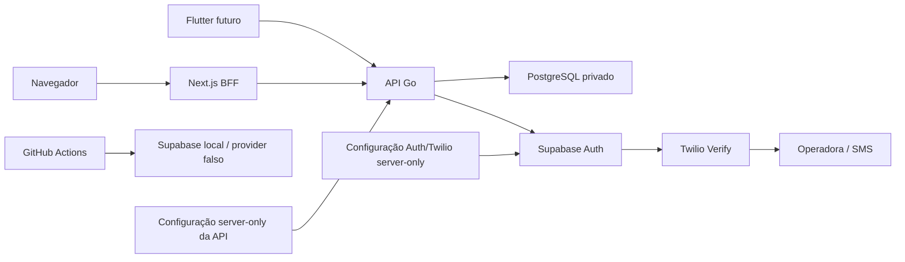

# Modelo de ameaças de identidade

- **Versão:** 1.0
- **Data:** 22 de julho de 2026
- **Escopo:** arquitetura da Fase 2; controles ainda não implementados
- **Método:** cenários por ativo e fronteira, com impacto e probabilidade
  qualitativos (`baixo`, `médio`, `alto`)

Este documento não afirma que o SysAP é invulnerável. Ele registra hipóteses,
controles planejados, sinais observáveis, resposta e risco residual que deverão
ser reavaliados a cada subfase.

## Escopo e premissas

- Clientes usam apenas a API Go; não há acesso direto a tabelas de negócio.
- Supabase Auth autentica; PostgreSQL é autoritativo para organização, papel e
  estado; API Go autoriza cada operação.
- Twilio Verify é provider preferencial inicial de OTP, somente pelo provider
  `twilio_verify` do Supabase Auth.
- Signup global, email e anônimo ficam desligados quando não usados;
  `auth.sms.enable_signup = false` e a flag equivalente a
  `shouldCreateUser: false` impedem criação por OTP.
- Local/CI usam apenas `auth.sms.test_otp`, destino reservado fictício,
  provider externo não configurado, credenciais ausentes e egress bloqueado.
- Staff usa senha e TOTP para atingir AAL2 antes de ações privilegiadas; SMS
  não é seu segundo fator preferencial.
- Todos os tempos persistidos são UTC; apresentação converte para
  `America/Fortaleza`.

## Ativos

| Ativo | Necessidade de proteção |
|---|---|
| Contas e vínculos | Integridade, disponibilidade, isolamento por organização. |
| Sessões, refresh tokens e tickets MFA | Confidencialidade, rotação, uso único, revogação e rastreabilidade. |
| Papéis e estado de acesso | Integridade e atualização imediata na autorização. |
| Matrícula | Integridade, unicidade e proteção contra enumeração; não é segredo. |
| Telefone, nome, nascimento e email de staff | Confidencialidade, minimização e retenção definida. |
| Identificador Auth | Integridade da ligação e não exposição como ID de negócio; pode existir em `sub` do JWT opaco. |
| Senha, OTP e código TOTP | Confidencialidade absoluta; nunca persistidos pelo SysAP. |
| Segredo/fator TOTP | Confidencialidade no enrollment e persistência exclusiva no Auth. |
| Chave server-only do Supabase | Confidencialidade, escopo e rotação. |
| Account SID, Auth Token e Verify Service SID | Configuração server-only; nenhum valor no Git ou cliente. |
| Signing keys e JWKS | Integridade, rotação, disponibilidade e cache limitado. |
| Logs e auditoria | Integridade, disponibilidade e ausência de segredos/PII direta. |
| Orçamento SMS | Limite de abuso, alerta e capacidade de interromper envio. |

## Atores

- atleta, treinador e owner legítimos;
- atacante externo não autenticado;
- usuário autenticado malicioso da mesma ou de outra organização;
- funcionário ou conta de staff comprometida;
- treinador abusivo que usa permissões legítimas fora da finalidade;
- pessoa com dispositivo roubado ou sessão copiada;
- operador com acesso indevido a segredo ou console;
- Supabase Auth ou Twilio Verify indisponível, degradado ou comprometido;
- automação de CI comprometida ou configuração de ambiente incorreta.

## Fronteiras de confiança e fluxo

Cada seta cruza uma fronteira. Dados de cliente são não confiáveis; respostas
de Auth/SMS são externas; claims são evidência de autenticação, não estado de
autorização; variáveis e logs podem vazar por erro operacional.

## Ameaças e tratamento

### Credenciais, matrícula e OTP

| Ameaça e cenário/ativo | Impacto / probabilidade | Prevenção | Detecção / resposta | Teste futuro / risco residual |
|---|---|---|---|---|
| **Credential stuffing:** pares de email/senha ou matrícula/senha vazados são automatizados contra contas. Ativos: conta e sessão. | Alto / alto. | Senha forte, blocklist quando suportada, TOTP para staff, limites por conta HMAC/IP e mensagens genéricas. | Detectar falhas distribuídas e anomalia de rede sem PII; atrasar/bloquear janelas, revogar sessões e forçar recuperação se houver sucesso suspeito. | Reproduzir lista fictícia distribuída; residual médio porque senhas podem ser reutilizadas fora do SysAP. |
| **Brute force:** tentativa exaustiva de senha, OTP ou TOTP. Ativos: conta, OTP e sessão. | Alto / alto. | Limites por identidade/convite/telefone/IP, seis dígitos com cinco minutos, contador que não reinicia ao reenviar e backoff. | Contar falhas e `429`; invalidar desafio, aumentar cooldown e alertar em pico. | Testar fronteiras, concorrência e recuperação; residual baixo/médio por ataque distribuído. |
| **Enumeração e timing:** status, mensagem ou latência revela matrícula, telefone, email, convite, suspensão ou organização. Ativos: identidades, PII e estados de acesso. | Médio/alto / alto. | Erro genérico, identificador Auth fictício constante, ordem de trabalho semelhante, recovery sempre `202`, mesma política para outro tenant/inexistente. | Métricas agregadas de latência por resultado interno, nunca expostas; corrigir desvio e rotacionar material se abuso gerar takeover. | Teste estatístico com registros existentes/inexistentes; residual baixo, pois uniformidade perfeita não é garantida. |
| **Replay de OTP:** código capturado é reutilizado na ativação/recuperação. Ativos: conta e telefone. | Alto / médio. | Uso único, TTL de cinco minutos, desafio ligado à identidade/propósito, nonce/idempotência e invalidação após sucesso. | Detectar segundo uso e tentativas após aprovação; revogar sessão resultante e abrir incidente. | Repetir em série e em corrida; residual baixo enquanto provider cumprir semântica comprovada. |
| **SIM swap/portabilidade:** atacante assume o número e recebe OTP. Ativos: conta, PII e sessão. | Alto / médio. | SMS só para identidade pré-cadastrada, aviso de risco, recuperação assistida, alteração de telefone com step-up; TOTP para staff. | Alertar mudança de telefone e ativação/sessão anômala com sinais já minimizados; suspender, revogar sessões e rever vínculo. | Simular troca de número sem coletar fingerprint de dispositivo no MVP; residual médio/alto inerente ao PSTN. |
| **SMS pumping e aumento de custo:** robô dispara OTP para destinos de receita elevada. Ativos: orçamento e disponibilidade. | Alto / alto. | Quota/circuit breaker rígido na API, limites HMAC/IP/convite/telefone, cooldown, Geo Permissions, Fraud Guard, destinos de staging restritos. | Volume, conversão, países, bloqueios, gasto e alertas; interromper envios, bloquear rota/destino, preservar ativação pendente e investigar. | Carga somente com provider falso; residual médio porque antifraude tem falso negativo e preço varia. |
| **Falso positivo antifraude ou SMS não entregue:** provider bloqueia atleta legítimo ou a rede falha. Ativos: disponibilidade e ativação. | Médio / médio. | Mensagem segura, retry limitado, estado `pending_activation`, suporte e alternativa futura não-PSTN; sem desfazer identidade. | Taxa de entrega/aprovação e erro categorizado sem telefone; pausar reenvios, orientar suporte e reconciliar. | Injetar timeout/bloqueio/atraso; residual médio porque SMS é best effort. |
| **Bypass da API pelo endpoint Auth:** atacante chama Supabase Auth diretamente para evitar rate limit/auditoria e disparar OTP de identidade existente. Ativos: conta, telefone e orçamento. | Alto / médio. | Assumir URL/publishable key descobríveis; negar sessão não registrada pela API, desligar todos os signups, validar método e provar limites Auth/provider, IP forwarding, CAPTCHA compatível e gateway/rede. SMS real fica bloqueado se o hard stop de custo for contornável. | Correlacionar volume Auth sem request da API, destino/região e custo; pausar OTP, bloquear rota/destino e rotacionar apenas credencial realmente secreta comprometida. | Chamar Auth local diretamente e provar rejeição da sessão, signup/limites; em staging autorizado testar caminho sem SMS de carga. Residual médio para pumping enquanto endpoint hospedado for público. |

### Autorização e isolamento

| Ameaça e cenário/ativo | Impacto / probabilidade | Prevenção | Detecção / resposta | Teste futuro / risco residual |
|---|---|---|---|---|
| **IDOR/BOLA:** membership ou convite da URL é trocado por outro UUID. Ativos: conta e PII. | Alto / alto. | Escopar toda consulta por sujeito, organização e permissão; UUID não substitui autorização; inexistente e outro tenant dão `404`. | Auditar acesso negado com IDs internos permitidos; suspender sessão em exploração repetida. | Matriz cruzada para cada endpoint com UUID alheio; residual baixo com checagem central obrigatória. |
| **Cross-tenant:** filtro é omitido, cache mistura tenants ou `X-Organization-ID` é confiado sem membership. Ativos: todos os dados do tenant. | Crítico / médio. | Header é só seletor; API resolve sujeito+membership ativa, filtro obrigatório, RLS adicional, cache inclui tenant e negação por padrão. | Canários/testes de isolamento e eventos negados; retirar versão, invalidar cache e avaliar exposição. | Testes de duas organizações, header ausente/alheio e recursos cruzados; residual baixo, mas erro humano continua possível. |
| **Elevação de privilégio:** cliente envia `role`, altera membership próprio ou usa claim antigo. Ativos: papéis, memberships e dados administrativos. | Crítico / médio. | DTO allowlist sem role em operações comuns, mudança exclusiva de owner+AAL2, estado autoritativo e auditoria imutável. | Alertar mudança de papel e ação privilegiada AAL1; reverter papel, revogar sessões e investigar ator. | Mass assignment e matriz owner/trainer/athlete; residual baixo/médio em conta owner comprometida. |
| **Abuso por treinador:** trainer legítimo cadastra, suspende ou consulta fora da finalidade. Ativos: contas de atletas, PII e auditoria. | Alto / médio. | Menor privilégio, escopo organizacional, MFA em ação privilegiada, motivo obrigatório e separação de ações reservadas ao owner. | Relatórios de volume e auditoria consultável pelo owner; suspender membership e preservar evidências. | Testar limites funcionais e anomalias de volume; residual médio por ameaça interna. |
| **Suspensão ignorada por JWT válido:** token ainda não expirado continua acessando. Ativos: estado de acesso e dados protegidos. | Alto / alto sem controle. | Consultar membership/estado em toda requisição ou cache curto invalidável; revogar sessões ao suspender; falhar fechado. | Evento de tentativa por sujeito suspenso; invalidar cache e tokens, corrigir rota faltante. | Suspender durante sessão e repetir todas as rotas; residual baixo condicionado à cobertura. |
| **Mass assignment:** payload altera `organization_id`, `auth_user_id`, role, estado ou campos de auditoria. Ativos: integridade de tenant, papel e auditoria. | Crítico / médio. | Schemas fechados, DTOs de comando explícitos e mapeamento por allowlist; rejeitar campos extras. | `422` agregado sem ecoar valor; investigar tentativas repetidas. | Fuzz de campos sensíveis e objetos aninhados; residual baixo. |

### Tokens e sessão

| Ameaça e cenário/ativo | Impacto / probabilidade | Prevenção | Detecção / resposta | Teste futuro / risco residual |
|---|---|---|---|---|
| **JWT forjado/adulterado:** assinatura ou claims são modificados. Ativos: signing keys, identidade e sessão. | Crítico / médio. | Assinatura verificada, algoritmos permitidos, `iss`, `aud`, `exp`, `nbf`, `sub` e tipo; autorização não vem de claims de role. | Registrar categoria segura de token inválido; bloquear e investigar padrão, rotacionar chave se comprometida. | Corpus de tokens adulterados; residual baixo com biblioteca revisada. |
| **`alg=none` ou confusão de algoritmo:** verificador aceita ausência/tipo indevido de assinatura. Ativos: identidade e sessão. | Crítico / baixo/médio. | Allowlist fixa e biblioteca que não deriva algoritmo do token; rejeitar `none`. | Métrica de rejeição por categoria; patch emergencial e rotação se houve aceitação. | Tokens `none`, HS/RS confusion e header duplicado; residual baixo. |
| **`kid` injection/SSRF/path traversal:** header força busca arbitrária ou seleção insegura. Ativos: JWKS, rede da API e sessão. | Crítico / médio. | `kid` apenas chave de lookup em JWKS de URL configurada; limite de tamanho/caracteres, sem URL dinâmica, um refresh controlado. | Detectar `kid` desconhecido/volume; bloquear, purgar cache controladamente e não seguir origem do token. | Fuzz de `kid`, URLs e muitos valores; residual baixo. |
| **Falha de rotação/JWKS:** chave nova é rejeitada ou revogada permanece em cache. Ativos: signing keys, disponibilidade e sessão. | Alto / médio. | TTL limitado, purge operacional, standby observado antes de rotação, refresh único em `kid` novo e falha fechada. | Métrica por `kid`, falha de JWKS e idade do cache; rollback/refresh e runbook de incidente. | Rotação local simulada e JWKS indisponível; residual médio pelo trade-off de cache. |
| **Roubo de token:** XSS, log, HTML, arquivo ou dispositivo expõe access/refresh token. Ativos: sessão, conta e dados. | Crítico / médio. | BFF com cookie `HttpOnly/Secure/SameSite`, CSRF, nada em Web Storage/HTML; Keychain no iOS e ciphertext privado com chave Keystore no Android; redação de logs. | Reuso/localidade anômala e scanner de segredo; revogar árvore, logout global e limpar dispositivo. | XSS/telemetria/log snapshots e dispositivo simulado roubado; residual médio. |
| **Replay/roubo de ticket MFA:** bearer de primeiro fator é copiado, reutilizado ou trocado de sujeito/fator. Ativos: ticket MFA, sessão AAL1 e conta staff. | Crítico / médio. | CSPRNG >=256 bits, TTL cinco minutos, digest HMAC, binding a sujeito/session/finalidade e a fator/challenge quando `purpose=verify`, contador e consumo atômico; access AAL1 em PostgreSQL cifrado por AEAD/chave externa versionada, sem refresh. | Detectar segundo uso, expiração e binding inválido sem logar ticket; consumir/revogar sessão e apagar ciphertext. | Replay, corrida, restart, múltiplas instâncias, ticket de outro sujeito/fator/finalidade e expiração; residual baixo/médio por comprometimento do canal. |
| **Logout incompleto:** access JWT continua aceito após sign-out. Ativos: sessão, conta e dados. | Alto / alto sem controle. | Registro local de `session_id` verificado em toda rota; revogar local antes do sign-out; corte por sujeito no logout global e token curto. | Detectar token de sessão revogada; negar, limpar cache e investigar uso posterior. | Logout atual/global seguido de uso do JWT ainda não expirado; residual baixo condicionado à consulta local. |
| **Reuso de refresh token:** token rotacionado é usado pelo atacante ou retry concorrente parece ataque. Ativos: refresh token e árvore de sessão. | Alto / médio. | Rotação do Supabase, single-flight por sessão, janela de retry comprovada e troca atômica; não persistir/cachear par novo. | Evento de reuse e refresh concorrente; revogar árvore e pedir novo login. | Corrida, retry de rede e replay fora da janela; residual baixo/médio. |
| **CSRF no Web:** navegador envia cookie de sessão em ação não intencional. Ativos: sessão e integridade dos comandos. | Alto / médio. | Token CSRF adequado ao BFF, validação de Origin, `SameSite`, métodos corretos e nada sensível por GET. | Falha de Origin/CSRF agregada; invalidar sessão em campanha confirmada. | Sites de origem adversária e ausência/token repetido; residual baixo. |
| **XSS com roubo/uso de sessão:** script executa no contexto do dashboard. Ativos: sessão, conta e PII exibida. | Crítico / médio. | Escape padrão, nenhuma API HTML bruta, CSP antes de autenticação pública, cookie HttpOnly e dependências auditadas. | CSP/reporting quando habilitado, erros e ações anômalas; remover vetor, revogar sessões e avisar afetados. | Payloads em todo conteúdo exibido e regressão CSP; residual médio porque HttpOnly não impede ações no browser. |

### Persistência, concorrência e integrações

| Ameaça e cenário/ativo | Impacto / probabilidade | Prevenção | Detecção / resposta | Teste futuro / risco residual |
|---|---|---|---|---|
| **SQL injection:** entrada alcança consulta dinâmica. Ativos: todas as tabelas. | Crítico / médio. | Parâmetros, identificadores fixos/validados, papel sem owner/BYPASSRLS e sem acesso direto de cliente. | Erros SQL seguros e métricas, nunca texto bruto; bloquear rota, rotacionar segredo e avaliar banco. | Fuzz/metacaracteres e análise de queries; residual baixo. |
| **Race condition:** ativar, reenviar, cancelar, suspender ou refresh concorrem e quebram invariantes. Ativos: estados, sessão, convite e auditoria. | Alto / alto. | Restrições, versão/lock transacional, estado validado, idempotência para comandos não secretos, single-flight para refresh e chamadas externas após commit. | Conflitos/retries e transições impossíveis; reconciliar e reparar estado por procedimento auditado. | Dezenas de goroutines/requisições no mesmo recurso; residual baixo/médio. |
| **Matrícula duplicada:** colisão CSPRNG ou corrida vence sem unicidade. Ativos: matrícula e vínculo do atleta. | Alto / baixo. | `CHECK`, `UNIQUE`, geração server-only e tentativas limitadas sem reutilização. | Violação de unicidade segura; gerar novamente ou falhar sem expor candidato. | Gerador determinístico com colisões concorrentes; residual muito baixo. |
| **Convite duplicado:** retry cria múltiplas identidades/SMS para o mesmo comando. Ativos: convite, identidade e orçamento. | Alto / médio. | Idempotency-Key + fingerprint apenas da projeção não secreta, regra de duplicidade e outbox única; segredo/derivado nunca entra no registro. | Métrica de conflito/duplicata; consolidar, cancelar excedente e reconciliar Auth. | Mesma chave/projeção, chave igual/projeção distinta e chaves simultâneas; residual baixo. |
| **Conta Auth órfã:** Supabase confirma e PostgreSQL falha antes do vínculo. Ativos: identidade Auth e consistência do vínculo. | Alto / médio. | Identificador externo e chave idempotente, estado intermediário, outbox e reconciliação; compensação só após provar propriedade. | Varredura de estados e operações sem vínculo; vincular/revogar/compensar com auditoria. | Falha injetada em cada fronteira de commit; residual baixo/médio pela consistência eventual. |
| **OTP consumido/senha alterada sem commit local:** ativação ou recovery vence no Auth e falha no PostgreSQL. Ativos: conta, convite, recovery e disponibilidade. | Alto / médio. | Convite usa `activation_finalizing`; recovery usa `identity_operations(account_recovery, processing)` e corte de sessão antes da chamada. Não reter segredo; login válido conclui a operação. | Detectar operação antiga/divergência Auth-local; manter tokens anteriores negados e orientar novo desafio quando Auth não atualizou. | Falha injetada antes/depois de OTP, senha e commit; residual médio até provar consulta segura do estado Auth. |
| **Indisponibilidade de Supabase Auth:** login, refresh ou provisionamento falham. Ativos: disponibilidade de contas e sessões. | Alto / médio. | Timeout, retry limitado apenas em operação segura, estado persistido; validação local de JWT assimétrico ainda válido quando possível. | Health operacional separado e taxa de erro; `503` genérico, pausar retries e reconciliar após recuperação. | Timeout, 5xx e recuperação; residual médio por dependência externa. |
| **Indisponibilidade do provider SMS:** envio ou `VerificationCheck` fica inacessível/atrasa. Ativos: ativação, recuperação e disponibilidade. | Alto / médio. | Timeout, retry seguro limitado, estado `pending_activation`, suporte e provider substituível; nenhuma chamada em transação. | Erro/latência/conversão sem PII; pausar reenvio, devolver estado seguro e reconciliar após retorno. | IdentityProvider fake injeta timeout/5xx; teste manual autorizado valida recuperação; residual médio por dependência externa. |
| **Comprometimento do provider SMS:** resposta de verificação ou credencial é manipulada. Ativos: conta, sessão, credenciais e PII. | Crítico / baixo. | TLS, segredo externo/rotacionável, binding ao sujeito/propósito e provider substituível; Supabase coordena, mas delega `VerificationCheck` ao Verify. | Aprovação/volume anômalo sem PII; desabilitar ativação, rotacionar credenciais, revogar sessões afetadas e trocar provider após ADR. | Fake retorna aprovação adversarial e credencial inválida; residual médio pela confiança necessária no provider. |

### Logs, segredos e cadeia de entrega

| Ameaça e cenário/ativo | Impacto / probabilidade | Prevenção | Detecção / resposta | Teste futuro / risco residual |
|---|---|---|---|---|
| **Log injection:** nome, motivo ou header injeta linhas/campos e engana auditoria. Ativos: logs, auditoria e detecção. | Médio / médio. | Logger estruturado, allowlist, normalização/limites e nenhum corpo bruto; request ID server-generated. | Parser detecta campo/controle inválido; isolar origem, preservar log bruto protegido e corrigir sanitização. | CR/LF, Unicode de controle e objetos grandes; residual baixo. |
| **Vazamento de segredo/PII em Git, CI, idempotência ou log:** token, senha, OTP, ticket, derivado enumerável, telefone, DSN ou credencial Twilio aparece. Ativos: segredos, PII, contas e sessões. | Crítico / médio. | Segredo externo, idempotência sem material secreto/derivado, `.env.example` só com nomes futuros, scanner, redaction, egress de CI bloqueado e revisão de diff/staged. | Gitleaks, canários e auditoria de acesso; revogar/rotacionar primeiro, remover histórico com procedimento e notificar responsáveis. | Fixtures adversariais de log/persistência e scanner; residual baixo/médio por erro humano. |
| **CI envia SMS real:** número fora do `test_otp` cai em provider configurado. Ativos: orçamento, telefone e confidencialidade da configuração. | Alto / baixo sem configuração. | Provider/credenciais ausentes, egress negado e único número reservado mapeado; testes falham fechados. | Monitorar tentativa de rede e garantir custo zero; interromper job, rotacionar segredo indevido e investigar configuração. | Testar destino mapeado/não mapeado com rede bloqueada; residual muito baixo. |

## Dados proibidos e allowlist de auditoria

Nunca registrar senha, OTP/TOTP, segredo/fator TOTP, ticket MFA, sessão AAL1,
access/refresh token, chave server-only, Authorization, cookie, telefone
completo, corpo de autenticação, DSN, email
completo ou erro bruto de PostgreSQL, Supabase/Twilio.

A allowlist futura contém somente: tipo do evento, resultado, IDs internos de
ator/alvo, `organization_id`, `request_id`, timestamp UTC, `reason_code`
enumerado e identificadores de rede protegidos pela política de retenção. O
papel da aplicação terá `INSERT`, não `UPDATE`/`DELETE`, na tabela de auditoria.

## Revisão e aceitação de risco

- Reavaliar ao fim de 2B, 2C, antes de staging e antes de produção.
- Todo controle precisa de teste listado no
  [plano adversarial](auth-adversarial-test-plan.md).
- SMS/PSTN conserva risco residual médio para SIM swap, entrega e custo. A
  produção fica bloqueada sem decisão formal e alternativa operacional.
- Nenhum resultado deste documento equivale a conformidade jurídica ou LGPD.

Referências de método e controles: [OWASP Threat Modeling Cheat
Sheet](https://cheatsheetseries.owasp.org/cheatsheets/Threat_Modeling_Cheat_Sheet.html),
[Authentication Cheat Sheet](https://cheatsheetseries.owasp.org/cheatsheets/Authentication_Cheat_Sheet.html),
[Authorization Cheat Sheet](https://cheatsheetseries.owasp.org/cheatsheets/Authorization_Cheat_Sheet.html),
[Logging Cheat Sheet](https://cheatsheetseries.owasp.org/cheatsheets/Logging_Cheat_Sheet.html)
e [PostgreSQL Row Security](https://www.postgresql.org/docs/17/ddl-rowsecurity.html).
